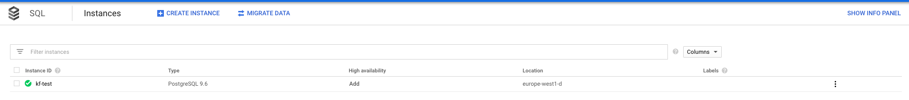
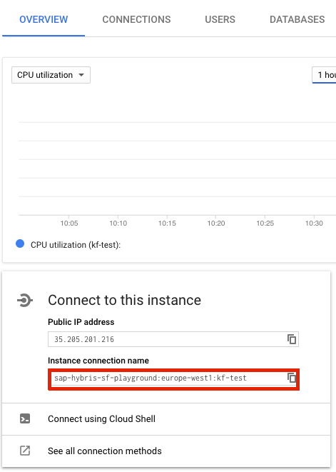

# Configure Managed GCP PostgreSQL

## Prerequisites

To set up the database, create the following:

* Cloud SQL Postgres instance on Google Cloud Platform with public IP assigned
* GCP Service Account with at least one of the following roles. For more information, see: ([Overview to connecting](https://cloud.google.com/sql/docs/postgres/connect-external-app#4_if_required_by_your_authentication_method_create_a_service_account)):
  - Cloud SQL Client
  - Cloud SQL Editor
  - Cloud SQL Admin

## Install Compass with managed GCP PostgreSQL database

To install Compass with GCP managed Postgres database, set the **database.embedded.enabled** value to `false` inside the `./chart/compass/values.yaml` file, and fill these values:

| Parameter | Description | Values | Default |
| --- | --- | --- | --- |
| `global.database.sqlProxyServiceAccount` | Specifies the name of a GCP service account, which is used to access the database | string | "proxy-user@gcp-cmp.iam.gserviceaccount.com" |
| `global.database.managedGCP.instanceConnectionName` | Specifies instance connection name to GCP PostgreSQL database | string | "" |
| `global.database.managedGCP.director.user` | Specifies the database username in the Director. | string | "" |
| `global.database.managedGCP.director.password` | Specifies the password to the user's database in the Director. | string | "" |
| `global.database.managedGCP.director.name` | Specifies the database name in the Director. | string | "" |
| `global.database.managedGCP.host` | Specifies cloudsql-proxy host | string | "localhost" |
| `global.database.managedGCP.hostPort` | Specifies cloudsql-proxy port | string | "5432" |
| `global.database.managedGCP.sslMode` | Specifies SSL connection mode | string | "" |

The access to the database is possible using [Workload Identity](https://cloud.google.com/kubernetes-engine/docs/concepts/workload-identity).
It allows a Kubernetes service account to act as an IAM service account.
Pods that use the configured Kubernetes service account automatically authenticate as the GCP service account when accessing Google Cloud APIs. 
All Kubernetes service accounts, which are used by workloads to access the database, have annotation "iam.gke.io/gcp-service-account" pointing to the `sqlProxyServiceAccount`. The `sqlProxyServiceAccount` is the IAM service account in GCP that is used by the service accounts of the Kubernetes workloads.

When you add a workload (deployment, job, etc.) that needs access to the database, you must perform the following steps:
  - Ensure that the workload has a Kubernetes service account associated with it.
  - Ensure that the Kubernetes service account has an annotation "iam.gke.io/gcp-service-account" that points to the `sqlProxyServiceAccount`.
  - Ensure that there is an IAM policy binding for `sqlProxyServiceAccount`, which contains the Kubernetes service account as a member.

To connect to managed database, we use [cloudsql-proxy](https://cloud.google.com/sql/docs/postgres/sql-proxy) provided by Google, which consumes `instanceConnectionName` value.

To find `Instance connection name`, go to the [SQL Instances page](https://console.cloud.google.com/sql/instances) and open desired database overview.

Then, look for `Instance connection name` box inside `Connect to this instance` section.

For the `director.user`, `director.password` values, use one of the accounts from the **USERS** tab. The `director.name` is the name of the available database. For the list of available names, see the **DATABASES** tab.

The `host` and the `hostPort` values specifies the cloudsql-proxy host and port. These are used directly by application to connect to proxy, and further to database.

The `sslMode` value specifies SSL connection mode to database. Check possible values [here](https://www.postgresql.org/docs/9.1/libpq-ssl.html) under `SSL Mode Descriptions` section.
