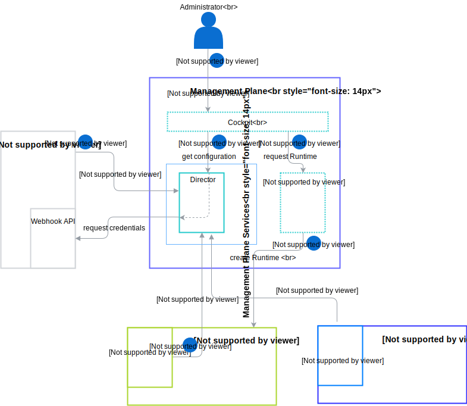

# API Credentials Flows

## Overview

This document describes how Application provides and updates credentials for API Definition per Runtime.

## Details
This diagram illustrates the API credentials flow in details. The Application provides Webhook API where Management Plane requests for providing new credentials for given API Definition.

>**NOTE:** There is an option that Application does not support Webhook API. That means Application needs to monitor registered API Definitions and set API credentials when new Runtime assigned. The Administrator can exchange credentials for registered APIs at any time too.

Assume we have Application with one API Definition which is already registered into Management Plane. No Runtimes assigned yet.

1. The Administrator requests new Runtime with Application via Cockpit.
2. The Cockpit requests configuration for Runtime and the Director asks Application for new credentials.
3. The Cockpit requests Runtime with configuration for Agent and Runtime Provisioner creates Runtime.
4. The Application sets API Definition credentials for given Runtime.
5. The Agent enables Runtime to call Application APIs.
