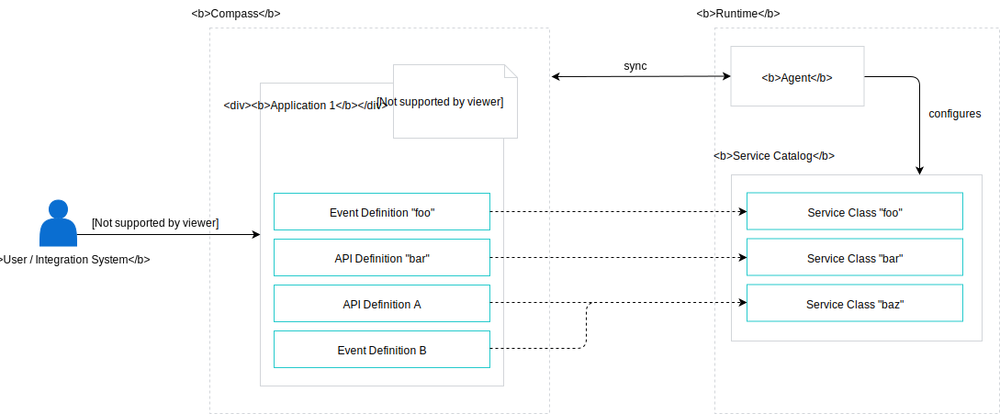

# API Package

## Introduction

By default, in Kyma Runtime, single API or Event Definition of a given Application is represented as a single Service Class in Service Catalog. To have control over this behavior, we introduce API Packages. API Package is a way of grouping multiple API or Event Definitions, so that they are represented as single Service Class.

## Solution



In order to create API packages, Compass utilizes Application labels. On Application level, Integration System or Application can specify package by using label in a form of the following key and value:

**Key:** `api-packages`

**Value:**

```json
{
  "foo": {
    "description": "",
    "metadata": {
      "displayName": "",
      "documentationURL": "",
      "supportURL": ""
    },
    "events": [
      "707ea9da-0bf8-4dad-8145-a934ee1ebffb",
      "6e5969c6-63fd-42c0-af17-72ed95c9dcd5"
    ],
    "apis": ["0ebea12e-cb15-4c1d-8df4-ce38bbb14842", "0ebea12e-cb15-4c1d-8df4-ce38bbb14842"]
  }
}
```

The root object key defines API Package name. In this example, `foo` is the API Package name.

In order to allow validation of the label value, Compass creates `api-packages` LabelDefinition automatically. It is done while creating new Application. Once Tenant management feature is ready, creating new tenant will be used as a trigger for the LabelDefinition creation.
The `api-packages` LabelDefinition has the following JSON schema:

```json
{
  "$id": "https://example.com/arrays.schema.json",
  "$schema": "http://json-schema.org/draft-07/schema#",
  "description": "Represents API Package",
  "type": "object",
  "propertyNames": {
    "pattern": "^[a-z0-9_-]*$",
    "minLength": 3,
    "maxLength": 35
  },
  "additionalProperties": {
    "anyOf": [{ "$ref": "#/definitions/apiPackage" }]
  },
  "definitions": {
    "apiPackage": {
      "type": "object",
      "required": ["events", "apis"],
      "properties": {
        "description": {
          "type": "string",
          "description": "Description"
        },
        "metadata": {
          "type": "object",
          "description": "Additional Metadata for Service Class representation"
        },
        "apis": {
          "type": "array",
          "uniqueItems": true,
          "items": {
            "pattern": "[0-9a-f]{8}-[0-9a-f]{4}-[0-9a-f]{4}-[0-9a-f]{4}-[0-9a-f]{12}"
          }
        },
        "events": {
          "type": "array",
          "uniqueItems": true,
          "items": {
            "pattern": "[0-9a-f]{8}-[0-9a-f]{4}-[0-9a-f]{4}-[0-9a-f]{4}-[0-9a-f]{12}"
          }
        }
      }
    }
  }
}
```

In a result, the `api-packages` label value is validated. Also, the API Package name uniqueness within Application is guaranteed. Event and API Definition existence is not checked, apart from verifying the UUID type of the ID arrays.

This schema cannot be modified by user. We validate this JSON schema against internal JSON schema, similarly to `scenarios` LabelDefinition.

### Assumptions

- API or Event Definition can be a part of API Package only within the same Application entity.
- API Package name doesn't have to be unique within tenant.

### Pros

- No breaking changes in our API
- Consistent implementation (identical to Scenarios)
- Static label validation

### Cons

- Additional logic on client side (see the [Client Usage](#client-usage) section)
- _(not important)_ No validation for existence of API/Event Definition IDs

## Example

> **NOTE:** For clarity, in this example IDs has been changed from UUID type to string.

1. User creates Application `sample-app`.
1. User registers three different API definitions with the following IDs: `foo`, `bar` and `baz`.
1. In order to create API Package called `sample-package`, User sets the following label for `sample-app` Application:

   **Key**: `api-packages`

   **Value:**

   ```json
   {
     "sample-package": {
       "description": "A Sample API Package",
       "metadata": {
         "displayName": "Sample Package",
         "documentationURL": "",
         "supportURL": ""
       },
       "events": [],
       "apis": ["bar", "baz"]
     }
   }
   ```

1. Runtime Agent configures Runtime.
1. In Service Catalog, there are two Service Classes: `foo` and `sample-package`, which contains single Service Plan with `bar` and `baz` APIs grouped.

## Client Usage

The following section describes client usage of the API Packages.

### Runtime Agent

To create Service Classes in Kyma Service Catalog from Application APIs and Event Definitions, Runtime Agent (or another component on Runtime side) has to populate the Service Class list.

In order to do so, Runtime Agent executes the following steps:

1. Query Applications for Runtime
1. For every Application:
   - Read `api-packages` label and populate ServiceClasses for API Packages. Agent generates IDs for these Service Classes.
   - Read all API and Event Definitions, excluding items from all API Packages. Every API or Event Definition is a Separate Class with ID equal to API/Event Definition ID.

### UI

To display all API Packages, UI executes the following steps:

1. Get all Applications
1. Read `api-packages` label value from every Application (if it does exist)
1. Display API Packages

As API Package name doesn't have to be unique within tenant, UI displays Application name for every API Package, to distinguish API Packages with equal names.

## Future

Currently we support grouping API and Event Definitions as single Service Class with single Service Plan.
In future we may introduce an ability to group API and Event Definitions as single Service Class with multiple Service Plans.

Also, the following points may be considered in future:
- API extension for returning processed list of Service Classes
- dynamic validation for API and Event Definition list in API Packages
- dynamic update of the API and Event Definition lists in API Packages, when an API or Event Definition is deleted 