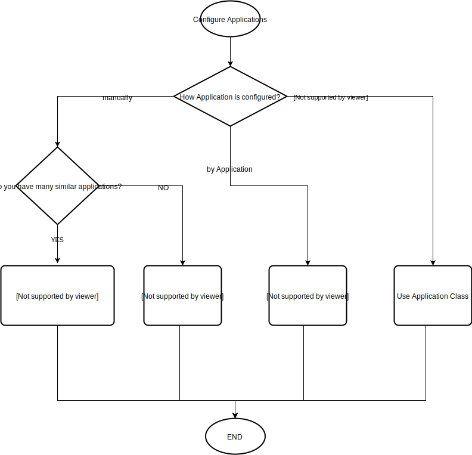
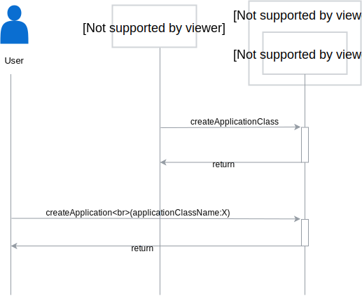

# ApplicationClass and ApplicationTemplate

Managing [Applications](./../terminology.md#Application) can be passed on some external system, to remove the burden of integration with Compass from Applications.
Because of that [IntegrationSystem](./../terminology.md#Integration-System) and ApplicationClass types were introduced.

To increase the reusability of the application configuration, we introduce ApplicationTemplate.
The diagram below describes when to use ApplicationClass or ApplicationTemplate.



## Terminology

- **ApplicationClass** represents an object for creating Applications. When you create an application from it, the IntegrationSystem
dynamically updates Application definition, such us APIs, EventAPIs etc.
   
- **ApplicationTemplate** represents an object for creating Applications from the static definition.

## GraphQL API Changes
   
1. Managing Application Class

    ```graphql
    input ApplicationClassInput {
        name: String!
        description: String
        global: Boolean! = true
        documents: [Document!]
        integrationSystemID: ID!
        previewApiSpecs: [ApiSpecInput!]
        previewEventApiSpecs: [EventApiSpecInput!]
    }
    
    input ApplicationInput {
        ...
        applicationClassName: String
        ...
    }
    
    
    type Mutation {
        createApplicationClass(in: ApplicationClassInput!): ApplicationClass!
        updateApplicationClass(id: ID!, in: ApplicationClassInput): ApplicationClass!
        deleteApplicationClass(id: ID!): ApplicationCLass!
    }
    
    type Query {
        applicationClasses(first: Int = 100, after: PageCursor): ApplicationClassPage!
        applicationClass(id: ID): ApplicationClass!
    }
    
    ```
`ApplicationClass.documents` is a place for documenting any manual steps required for managing Application of given class by 
a Integration System defined by `integrationSystemID`. For example, it can contain information on how to register a given application
in the integration system if it is not performed by the Integration System automatically. 

`previewApiSpecs` and `previewEventApiSpecs` are optional fields that document what kind of API a user can expect after creating 
Application originated from the ApplicationClass. The final API can differ from those presented in preview fields, for example, some API can be missing
because the user lacks privileges to access them. 

In the first iteration, ApplicationClass can be registered only globally (`ApplicationClass.global`), so it will be available for every tenant. 
To create the Application of given class, the user set field `applicationClassName` in `ApplicationInput`. This field is optional.
In case `applicationClassName` is provided, Compass adds two labels to the Application:
- `applicationClass`
- `integrationSystemID`

Thanks to that, the Integration System can query for all Application managed by the given Integration System or query for 
Application with the given ApplicationClass.
`deleteApplicationClass` is possible only if there are no classes originated from this ApplicationClass. 

Extending API with ApplicationClass introduces new requirements for Integration Systems.
Integration System can be removed only when:
- there is no Application Class from this Integration System
- there is no Application managed by the Integration System 

2. Managing Application Template 

    ```graphql
    input ApplicationTemplateInput {
        name:               String!
        description:        String
        applicationInput:   ApplicationInput!
        placeholders:       [PlaceholderDefinitionInput]
    }
     
    input PlaceholderDefinitionInput {
        Name            String!
        Description     String
    }
    
    input TemplateValueInput {
        Placeholder     String!
        Value           String!
    }
    
    type Mutation {
        createApplicationTemplate(in: ApplicationTemplateInput!): ApplicationTemplate!
        updateApplicationTemplate(id: ID!, in: ApplicationTemplateInput!): ApplicationTemplate!
        deleteApplicationTemplate(id: ID!): ApplicationTemplate!
        
        createApplicationFromTemplate(templateName: String!, values: [TemplateValueInput]): Application!
    
    }
    
    type Query {
        applicationTemplates(first: Int = 100, after: PageCursor): ApplicationTemplatePage!
        applicationTemplate(id: ID!): ApplicationTemplate
    }
    
    ```
ApplicationTemplate can be treated as a prepopulated ApplicationInput with additional placeholders that have to be replaced by the user who creates Application from a template. 
When defining ApplicationTemplate, all placeholders have to be documented in 
`placeholders` field. To create an application from the template, a new mutation `createApplicationFromTemplate` is used.

   
## Workflows
### Create Application Class and Application


1. Integration System fetches access token from Hydra public API and then register Application Class using mutation
 
    ```graphql
    createApplicationClass(in:{name: "ClassX",integrationSystemID:"{ID}" })
    ```

2. User request for creating an application using Application Class with the following mutation:
    ```graphql
    createApplication(in:{name:"my app", applicationClassName:"ClassX"})
    ```
The integration system can define additional steps (also manual) to be performed after creating a given application. 
This kind of information is stored in the `ApplicationClass.document`.

### Create Application Template and Application
1. Create an Application Template
    ```graphql
    createApplicationTemplate(
        in:{
            name:"Y-Template", 
            applicationInput:{
                  Name:"{{APPLICATION_NAME}}",
                  apis: [
                    {
                      name: "comments/v1"
                      description: "api for adding comments"
                      targetURL: "http://mywordpress.com/comments"                 
                    }]
             },
             placeholders:[
             {
                Name:"APPLICATION_NAME",
                Description:"Name of the application"
             }],
        })
    
    ```

2. Create Application from template
    ```graphql
    createApplicationFromTemplate(templateName: "Y-Template", values: [{Placeholder:"APPLICATION_NAME", Value:"MyApplication"}]): 
    
    ```