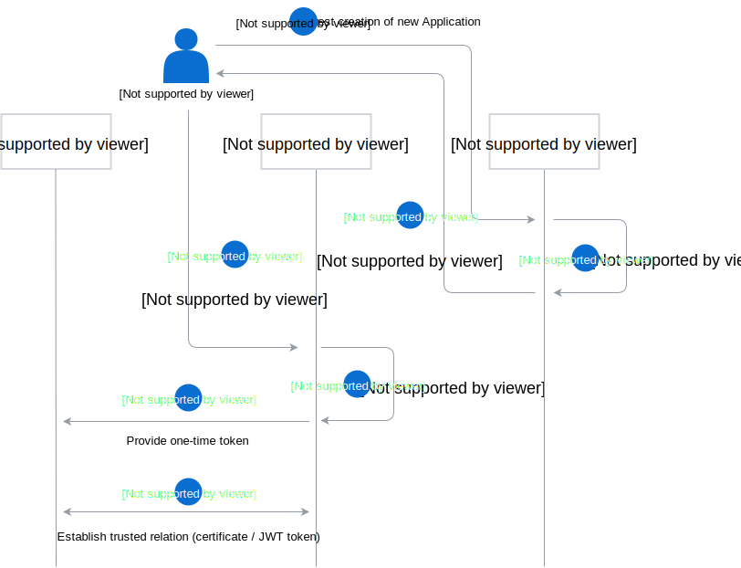
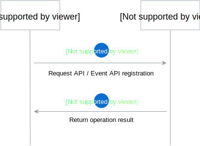
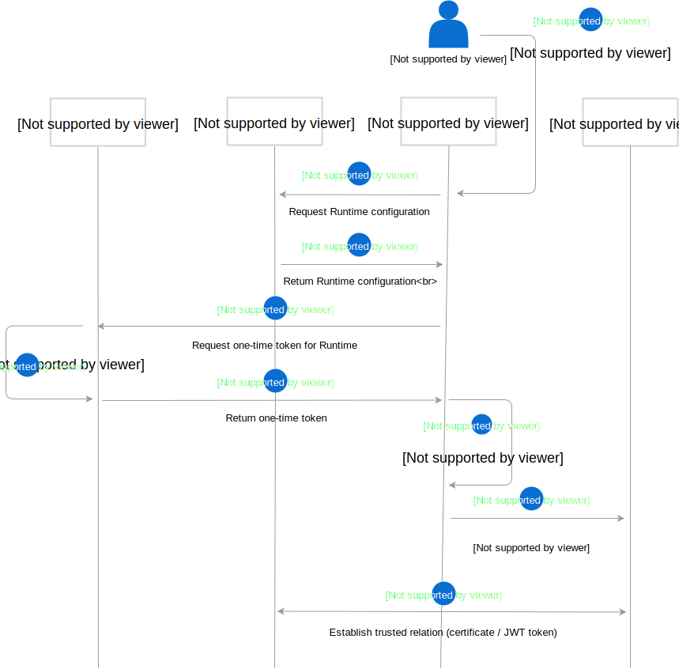
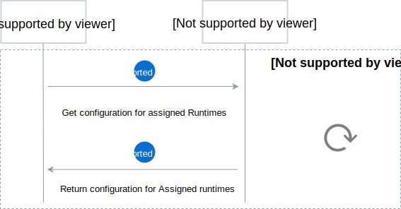
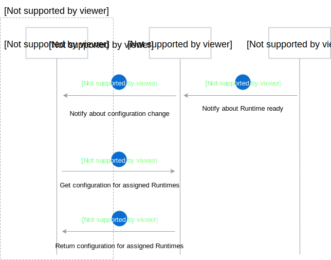
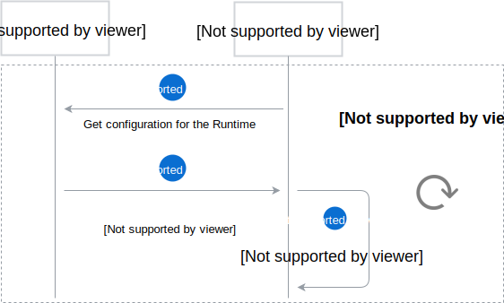

# Application and Runtime flows

The following diagrams shows interactions between [Application](./../terminology.md#application), [Management Plane](./../terminology.md#management-plane) and [Runtime](./../terminology.md#runtime).

## Application connection

Application connection consists of two phases: Application pairing and API registration. In the process of connecting new Application, two Management Plane's components are involved: [Director](./../terminology.md#mp-director) and [Connector](./../terminology.md#mp-connector).

### Application pairing phase

Application pairing phase is a process of creating new Application in Management Plane and establishing trusted connection between Application and Management Plane. 

Administrator requests Director to create a new Application in the Management Plane. Director sends back Application details, along with its unique ID. Then, Administrator requests Application pairing to the Connector. Connector generates one-time token, and Administrator passes it to the Application. Application uses this token to establish a trusted relation between Application and Management Plane.

To learn about implementation details of the pairing process, see the [Establishing trusted connection](./establishing-trusted-connection.md).

### API registration phase

API registration phase is a process of registering new API and Event API definitions. Application requests API or Event API registration and receives operation result.

## Runtime creation

To create a new Runtime, Administrator sends proper request to the [Runtime Provisioner](./../terminology.md#mp-runtime-provisioner). Runtime Provisioner requests Runtime configuration from Director, and one-time token from Connector. Runtime Provisioner provisions Runtime, and then injects the configuration with one-time token. [Runtime Agent](./../terminology.md#runtime-agent) uses this token to set-up trusted connection between Management Plane and Runtime Agent.

When Runtime is ready, Runtime Agent notifies Director about its status. When the Director receives notification that a Runtime is ready, it passes the notification for every Application in group assigned to the Runtime via [Application Webhook API](./../terminology.md#application-webhook-api). See the [Application configuration update diagram](#application-configuration-update) for Runtime ready notification example.

## Configuration change

The following section describes configuration update flows for Application and Runtime.

### Application configuration update

Application can choose between two options of updating configuration: periodically fetching configuration or exposing [Application Webhook API](./../terminology.md#application-webhook-api) for configuration update notifications.

In the first case, Application periodically pulls configuration details for connected Runtimes, such as `eventURL`.

In the second case, if any connected Runtime changes, Application is notified via Application Webhook API that new configuration details are available. The following diagram shows the interaction between Runtime Agent, Director and Application, when a new Runtime is provisioned and configured successfully:

When connected Runtime is runtime, Application generates API credentials for it and sends them to Director. To learn more about API Credentials flow, see the [API Credentials flow diagram](./../architecture/api-credentials-flows.md).

### Runtime configuration update

Runtime gets configuration details from Director, including application list with theirs credentials, and applies the configuration asynchronously. Runtime Agent checks periodically for new configuration details and applies them, if they changes.

