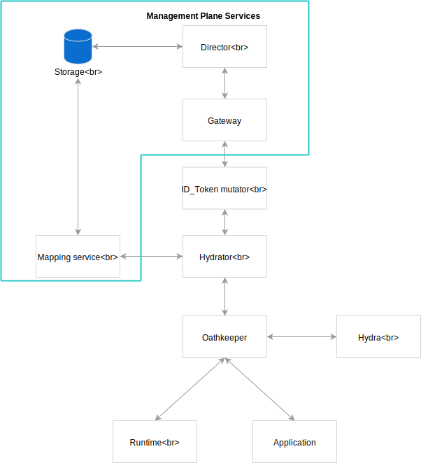
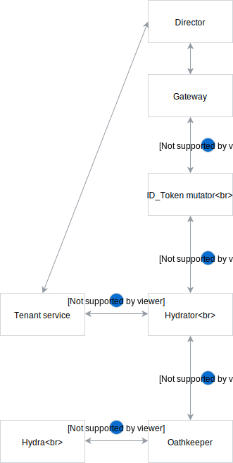

# Authentication and Authorization

## Introduction
Currently, communication between the Compass and both runtimes and applications are not secured. We need to provide some security possibilities.
We want to secure the Compass using ORY's Hydra and OathKeeper. There would be two ways of authentication:
 - OAuth 2.0 
 - Client Certificates (mTLS)

## Proposed solution
As mentioned, there would be two possibilities for securing the connection. To achieve that, first, we need to integrate Hydra and OathKeeper into the Compass. We need to implement additional supporting components to make our scenarios valid. On the Director component, we will implement an OathKeeper [hydrator](https://github.com/ory/docs/blob/525608c65694539384b785355d293bc0ad00da27/docs/oathkeeper/pipeline/mutator.md#hydrator) handler that will resolve `client_id` (which can be `runtime ID` or `application ID`) to particular `tenant ID`. The ID_token mutator which is Hydra built-in, will be responsible for creating a JWT token with the `tenant` field.

Having that setup, the flow would be as follows: 

1. Runtime/Application calls the OathKeeper.
2. OathKeeper calls Hydrator with `client_id` or `runtime ID`/`application ID` attached to the request.
3. Hydrator calls Tenant Service and gets `tenant` in response.
4. Hydrator calls ID_token mutator with `tenant` attached to the request
5. The ID_token mutator constructs a JWT token with scopes and `tenant` in the payload.
6. The token issued by ID_token mutator can be used to authenticate to the Gateway.

## Architecture

### Tenant service
It is a service responsible for mapping `client_id` (OAuth 2.0 flow), `runtime ID` or `application ID` (certificates flow) to `tenant`. There will be a simple HTTP endpoint on the Director component, responsible for retrieving it from the database. 

## Flows

### OAuth 2.0
There are two ways of creating a `client_id` and `client_secret` pair in the Hydra, using Hydra's [oauth client](https://github.com/kyma-project/kyma/blob/ab3d8878d013f8cc34c3f549dfa2f50f06502f14/docs/security/03-06-oauth2-server.md#register-an-oauth2-client) or [simple POST request](https://github.com/kyma-incubator/examples/tree/master/ory-hydra/scenarios/client-credentials#setup-an-oauth2-client).

Receiving token:
1. Runtime/Application calls Hydra with encoded credentials (`client_id` is the `runtime ID`/`application ID`) and requested scopes.
2. If the requested scopes are valid, Runtime/Application receives in response an access token, otherwise receives an error.

Request flow:
1. OathKeeper calls Hydra for introspection of the token.
2. If the token is valid, OathKeeper sends the request to Hydrator. 
3. Hydrator calls Tenants handler hosted by `Director` to get `tenant` based on a `client_id`.
4. Hydrator calls ID_Token mutator which constructs a JWT token with scopes and `tenant` in the payload.
5. ID_Token mutator calls the Compass Gateway.
 

### Certificates
TODO

### Communication between Runtime and Application
TODO

## Summary

### OAuth 2.0
Things to be done: 
- Integrate Hydra and OathKeeper into the Compass [(POC)](https://github.com/kyma-incubator/compass/issues/290)
- Managing tenants
- Tenant service
