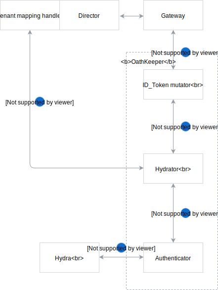

# Authentication and Authorization

## Introduction
Currently, communication between the Compass and both Runtimes and Applications are not secured. We need to provide some security possibilities.
We want to secure the Compass using ORY's Hydra and OathKeeper. There would be three ways of authentication:
 - OAuth 2.0 
 - Client Certificates (mTLS)
 - JWT token issued by Dex

 There would be three possibilities for securing the connection. To achieve that, first, we need to integrate Hydra and OathKeeper into the Compass. We also need to implement additional supporting components to make our scenarios valid.

## Architecture

The following diagram represents architecture of the security in Compass:


### Tenant mapping handler

It is a OathKeeper [hydrator](https://github.com/ory/docs/blob/525608c65694539384b785355d293bc0ad00da27/docs/oathkeeper/pipeline/mutator.md#hydrator) handler responsible for mapping `client_id` to tenant. It will be built into the Director component, as a separate endpoint responsible for retrieving the tenant ID based on database query.
In order to map client_id from Runtime Agent to tenant, we will query `client_id` from Runtime `agentAuth` JSONB field.
In order to map client_id from Application to tenant, we need to extend Application model with `auth` JSONB field. Then, we can query `client_id` from Application `auth` JSONB field.

To unify tenant mapping, `client_id` will be not only generated in OAuth 2.0 flow, but also in Certificates flow. We will write it into certificate. In a result, these two flows we will map `client_id` to tenant.

### GraphQL security

The Gateway passes request along with JWT token to Compass GraphQL services, such as Director or Connector. The GraphQL components will have authentication middleware and GraphQL [directives](https://graphql.org/learn/queries/#directives) set up for all GraphQL operations (and some specific type fields, if necessary).

In GraphQL services, there will be a HTTP authentication middleware set up, which validates and decodes JWT token. It puts user scopes and tenant in request context 
(`context.Context`).


When GraphQL operation is processed, an authorization directive is triggered, before actual GraphQL resolver. It will check if the client has required scopes to do the requested operation. To avoid defining permissions statically in GraphQL schema, a YAML file will be loaded with needed requests. In a reality, it will be a ConfigMap injected to Director/Connector. 

The following example illustrates how we can implement dynamic comparison between required scopes and request scopes for example mutations, queries and type fields:

```graphql

type Mutation {
    createApplication(in: ApplicationInput!): Application! @secureWithScopes(path: "mutations.createApplication")
    updateApplication(id: ID!, in: ApplicationInput!): Application! @secureWithScopes(path: "mutations.updateApplication")
    deleteApplication(id: ID!): Application @secureWithScopes(path: "mutations.deleteApplication")
}


type Query {
    runtimes(filter: [LabelFilter!], first: Int = 100, after: PageCursor): RuntimePage! @secureWithScopes(path: "queries.runtimes")
    runtime(id: ID!): Runtime @secureWithScopes(path: "queries.runtime")
}

type Application {
    id: ID! 
    name: String!
    description: String
    labels(key: String): Labels!
    status: ApplicationStatus!
    webhooks: [Webhook!]! @secureWithScopes(path: "types.Application.webhooks")
    healthCheckURL: String
    apis(group: String, first: Int = 100, after: PageCursor): APIDefinitionPage! @secureWithScopes(path: "types.Application.apis")
    eventAPIs(group: String, first: Int = 100, after: PageCursor): EventAPIDefinitionPage! @secureWithScopes(path: "types.Application.eventAPIs")
    documents(first: Int = 100, after: PageCursor): DocumentPage! @secureWithScopes(path: "types.Application.documents")
}
```

The `path` parameter would specify path in YAML file (ConfigMap) with required scopes for a given resolver. For example:
```yaml
queries:
    runtimes: "runtime:list"
    runtime: "runtime:get"
mutations:
    createApplication: "application:create"
    updateApplication: "application:update"
    deleteApplication: "application:delete"
types:
    Application:
        webhooks: "webhook:list"
        apis: "api:list"
        eventAPIs: "eventapi:list"
        documents: "document:list"
```
The actual scopes will be defined later.

## Flows

Each flow will be set up on a separate host via different VirtualService, as currently OathKeeper doesn't support certificates and multiple `Bearer` authenticators.

### OAuth 2.0
There are two ways of creating a `client_id` and `client_secret` pair in the Hydra, using Hydra's [oauth client](https://github.com/kyma-project/kyma/blob/ab3d8878d013f8cc34c3f549dfa2f50f06502f14/docs/security/03-06-oauth2-server.md#register-an-oauth2-client) or [simple POST request](https://github.com/kyma-incubator/examples/tree/master/ory-hydra/scenarios/client-credentials#setup-an-oauth2-client).

**Obtaining token:**
1. Runtime/Application calls Hydra with encoded credentials (`client_id` is the `runtime ID` or `application ID`) and requested scopes.
2. If the requested scopes are valid, Runtime/Application receives in response an access token, otherwise receives an error.

**Request flow:**
1. Authenticator calls Hydra for introspection of the token.
1. If the token is valid, OathKeeper sends the request to Hydrator. 
1. Hydrator calls Tenant mapping handler hosted by `Director` to get `tenant` based on a `client_id`.
1. Hydrator passes response to ID_Token mutator which constructs a JWT token with scopes and `tenant` in the payload.
1. The request is then forwarded to the desired component (such as `Director` or `Connector`) through the `Gateway` component.
 


**Proof of concept:** [kyma-incubator/compass#287](https://github.com/kyma-incubator/compass/pull/287)

### JWT token issued by identity service

To be defined.

**Obtaining token:**
User logs in to Compass UI 

**Request flow:**
1. Authenticator validates the token using keys provided by identity service. In production environment, tenant **must be** included in token payload. For local development, the `tenant` property is missing from token issued by Dex.
1. If the token is valid, OathKeeper sends the request to Hydrator.
1. Hydrator calls Tenant mapping handler hosted by `Director`, which, in production environment, returns **the same** authentication session (as the `tenant` is already in place). For local development, `tenant` is loaded from ConfigMap, where static `user:tenant` mapping is done.
1. Hydrator passes response to ID_Token mutator which constructs a JWT token with scopes and `tenant` in the payload.
1. The request is then forwarded to the desired component (such as `Director` or `Connector`) through the `Gateway` component.
 


### Certificates

To be defined.
