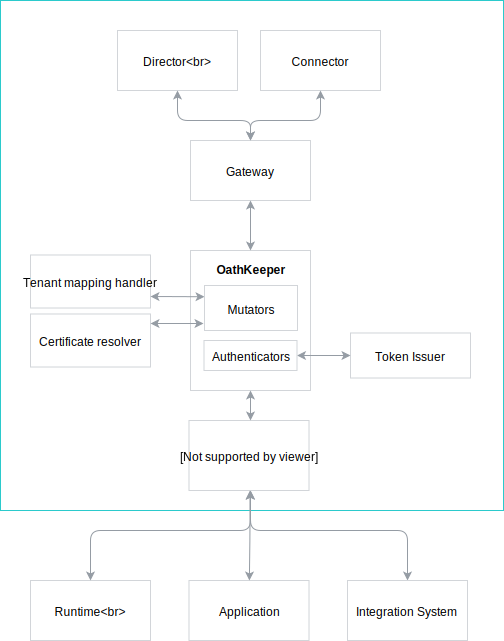

# Authentication and Authorization

## Introduction
Currently, communication between the Compass and both Runtimes and Applications are not secured. We need to provide some security possibilities.
We want to secure the Compass using ORY's Hydra and OathKeeper. There would be three ways of authentication:
 - OAuth 2.0 
 - Client Certificates (mTLS)
 - JWT token issued by Dex

 There would be three possibilities for securing the connection. To achieve that, first, we need to integrate Hydra and OathKeeper into the Compass. We also need to implement additional supporting components to make our scenarios valid.

## Architecture

The following diagram represents the architecture of the security in Compass:



### Tenant Mapping Handler

It is an OathKeeper [hydrator](https://github.com/ory/docs/blob/525608c65694539384b785355d293bc0ad00da27/docs/oathkeeper/pipeline/mutator.md#hydrator) handler responsible for mapping authentication session data to tenant. It could be built into Director itself, as it will also use the same database. It would be implemented as a separate endpoint, such as `/tenant-mapping`.

To unify the approach for mapping, we could introduce `authorization_id`, widely used by multiple authentication flows.
The `authorization_id` is equal to:
- `client_id` in OAuth 2.0 authentication flow 
- `username` in Basic authentication flow
- Common Name (CN) in Certificates authentication flow

While generating one-time token, `client_id`/`client_secret` pair or basic authentication details for Runtime/Application/IntegrationSystem (using proper GraphQL mutation on Director), an entry in `system_auths` table in Director database is created. The `system_auths` table is used for tenant mapping.

#### `system_auths` table

The table is used by Director and Tenant Mapping Handler. It would contain the following fields:
- `id`, which will be the `authorization_id`
- `tenant` (optional field - used for Application and Runtime, not used for Integration System)
- `app_id` foreign key of type UUID
- `runtime_id` foreign key of type UUID
- `integration_system_id` foreign key of type UUID
- `value` of type JSONB (with authentication details, such as `client_id/client_secret`, `username/password`; in case of certificates it will be empty)

### GraphQL security

The Gateway passes request along with JWT token to Compass GraphQL services, such as Director or Connector. The GraphQL components will have authentication middleware and GraphQL [directives](https://graphql.org/learn/queries/#directives) set up for all GraphQL operations (and some specific type fields, if necessary).

#### HTTP middleware

In GraphQL servers, such as Director or Connector, there will be a HTTP authentication middleware set up, which validates and decodes JWT token. It puts user scopes and tenant in request context 
(`context.Context`).


#### GraphQL Directives

When GraphQL operation is processed, an authorization directive is triggered, before actual GraphQL resolver. It will check if the client has required scopes to do the requested operation. To avoid defining permissions statically in GraphQL schema, a YAML file will be loaded with needed requests. In a reality, it will be a ConfigMap injected to Director/Connector. 

The following example illustrates how we can implement dynamic comparison between required scopes and request scopes for example mutations, queries and type fields:

```graphql

type Mutation {
    createApplication(in: ApplicationInput!): Application! @secureWithScopes(path: "mutations.createApplication")
    updateApplication(id: ID!, in: ApplicationInput!): Application! @secureWithScopes(path: "mutations.updateApplication")
    deleteApplication(id: ID!): Application @secureWithScopes(path: "mutations.deleteApplication")
}


type Query {
    runtimes(filter: [LabelFilter!], first: Int = 100, after: PageCursor): RuntimePage! @secureWithScopes(path: "queries.runtimes")
    runtime(id: ID!): Runtime @secureWithScopes(path: "queries.runtime")
}

type Application {
    id: ID! 
    name: String!
    description: String
    labels(key: String): Labels!
    status: ApplicationStatus!
    webhooks: [Webhook!]! @secureWithScopes(path: "types.Application.webhooks")
    healthCheckURL: String
    apis(group: String, first: Int = 100, after: PageCursor): APIDefinitionPage! @secureWithScopes(path: "types.Application.apis")
    eventAPIs(group: String, first: Int = 100, after: PageCursor): EventAPIDefinitionPage! @secureWithScopes(path: "types.Application.eventAPIs")
    documents(first: Int = 100, after: PageCursor): DocumentPage! @secureWithScopes(path: "types.Application.documents")
}
```

Instead of defining manually these directives in GraphQL schema, we can automate it using [gqlgen](https://gqlgen.com/reference/plugins/) plugins.

The `path` parameter would specify path in YAML file (ConfigMap) with required scopes for a given resolver. For example:
```yaml
queries:
    runtimes: "runtime:view"
    runtime: "runtime:view"
mutations:
    createApplication: "application:admin"
    updateApplication: "application:admin"
    deleteApplication: "application:admin"
types:
    Application:
        webhooks: "webhook:view"
        apis: "api:view"
        eventAPIs: "eventapi:view"
        documents: "document:view"
```

The actual scopes will be defined later.

#### Limiting Application/Runtime modifications

Application/Runtime shouldn't be able to modify other Applications or Runtimes. In future, to limit the functionality, we could introduce another GraphQL directive.

```graphql
type Mutation {
    updateApplication(id: ID!, in: ApplicationInput!): Application! @secureWithScopes(path: "mutations.updateApplication") @limitModifications(type: APPLICATION, idParamName: "id")
}
```

The `limitModifications` mutation would compare ID provided for the `updateApplication` mutation with Application ID saved in the context by Tenant Mapping Handler.

## Authentication flows

Each authentication flow will be handled on a separate host via different VirtualService, as currently OathKeeper doesn't support certificates and multiple `Bearer` authenticators.

### OAuth 2.0 Access Token

**Used by:** Integration System / Application / Runtime

There are two ways of creating a `client_id` and `client_secret` pair in the Hydra, using Hydra's [oauth client](https://github.com/kyma-project/kyma/blob/ab3d8878d013f8cc34c3f549dfa2f50f06502f14/docs/security/03-06-oauth2-server.md#register-an-oauth2-client) or [simple POST request](https://github.com/kyma-incubator/examples/tree/master/ory-hydra/scenarios/client-credentials#setup-an-oauth2-client).

**Obtaining token:**

1. Runtime/Application/IntegrationSystem requests `client_id` and `client_credentials` pair from Director by separate GraphQL mutation. Director generates the pair, registers it in Hydra with proper scopes (defined by object type) and writes it in database.
1. Runtime/Application/IntegrationSystem calls Hydra with encoded credentials (`client_id` is the ID of `SystemAuth` entry related to given Runtime/Application/IntegrationSystem) and requested scopes.
1. If the requested scopes are valid, Runtime/Application/IntegrationSystem receives in response an access token, otherwise receives an error.

**Request flow:**

1. Authenticator calls Hydra for introspection of the token.
1. If the token is valid, OathKeeper sends the request to Hydrator. 
1. Hydrator calls Tenant Mapping Handler hosted by `Director` to get `tenant` based on a `client_id` (`client_id` is the ID of `SystemAuth` entry related to given Runtime/Application/IntegrationSystem) .
1. Hydrator passes response to ID_Token mutator which constructs a JWT token with scopes and `tenant` in the payload.
1. The request is then forwarded to the desired component (such as `Director` or `Connector`) through the `Gateway` component.
 


**Scopes**

In this authentication flow, scopes are read from OAuth 2.0 access token and written directly in output JWT token. Hydra validates if user can request access token with given scopes.

**Proof of concept:** [kyma-incubator/compass#287](https://github.com/kyma-incubator/compass/pull/287)

### JWT token issued by identity service

**Used by:** User

**Obtaining token:**

User logs in to Compass UI 

**Request flow:**

1. Authenticator validates the token using keys provided by identity service. In production environment, tenant **must be** included in token payload. For local development, the `tenant` property is missing from token issued by Dex.
1. If the token is valid, OathKeeper sends the request to Hydrator.
1. Hydrator calls Tenant Mapping Handler hosted by `Director`, which, in production environment, returns **the same** authentication session (as the `tenant` is already in place). For local development, `tenant` is loaded from ConfigMap, where static `user - tenant` mapping is done.
1. Hydrator passes response to ID_Token mutator which constructs a JWT token with scopes and `tenant` in the payload.
1. The request is then forwarded to the desired component (such as `Director` or `Connector`) through the `Gateway` component.
 


**Scopes**

For local development, user scopes will be loaded from ConfigMap, where static `user - scopes` mapping is done.

**Example ConfigMap for local development**

```yaml
admin@kyma.cx:
    tenant: edf2e0c0-58b1-45c6-b345-fabc9774600c
    scopes:
        - application:admin
        - runtime:admin
foo@bar.com:
    tenant: c862d791-2735-4ffb-ae2d-3ace408d6cff
    scopes:
        - application:view
        - runtime:view
```

### Certificates

To be defined.

