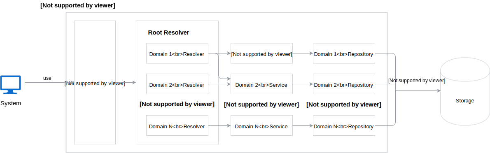

# Director Component

## Overview

This document describes [Director](../terminology.md)'s architecture.

## Architecture

The following diagram illustrates the overall architecture of this application:



### Root Resolver

Root Resolver is a type, which composes of Domain Resolver types. In a result, Root Resolver consists of all GraphQL resolvers needed to run the GraphQL server.  

### Domain Resolver

Domain Resolver is a set of GraphQL resolvers related to a specific domain. For example, Runtime Domain Resolver contains all GraphQL resolvers related to Runtime type, including queries, mutations and field resolvers.

Domain Resolver uses Services. To convert from domain model to GraphQL types, Domain Resolver uses converters, which are types that contain conversion methods.

### Service

Service contains business logic related to a specific domain. Single Resolver can use multiple Services from different domain packages. To do CRUD operations, Service uses Repository.

### Repository

Repository is an abstraction over storage access. It is used for CRUD operations on database. In future, it may be separated from the Director as an additional component.

As an example, the following Repository interface is defined for Runtime:

```golang
type Repository interface {
	GetByID(id string) (*model.Runtime, error)
	List(filter []*labelfilter.LabelFilter, pageSize *int, cursor *string) (*RuntimePage, error)
	Create(item *model.Runtime) error
	Update(item *model.Runtime) error
	Delete(item *model.Runtime) error
}
```

Additional methods, for example with more complex database queries, can be defined on-demand.