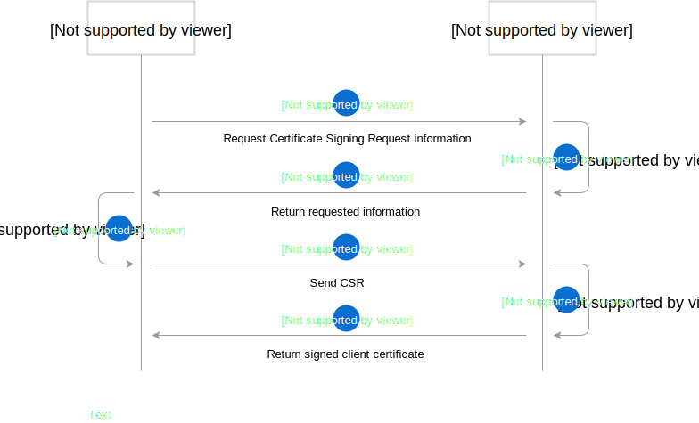

# Establishing a trusted connection

The following document describes flow that needs to be performed to establish trusted connection between Application, Management Plane, and Runtime. Currently trusted relation is confirmed by client certificate that is generated by Connector.

## Client certificate flow

This diagram shows the sequence of API calls that allows the Application or Runtime to establish a trusted connection using a client certificate.

> **NOTE:** All API calls to the Connector require valid one-time token that can be also obtained from Connector API.

The external system (Application / Runtime) requests from Connector detailed information
required to generate the Certificate Signing Request (CSR). In the response Connector also returns new one-time token that should be used when sending the CSR API call.

The external system generates a CSR based on information provided by the Connector and sends the CSR to the Connector. In response, the external system receives a signed certificate. It can use the certificate to authenticate the further communication between Management Plane, Runtimes and Applications.

## Client certificate flow - certificate renewal

> **NOTE** All API calls to Connector during the certificate renewal process require a valid client certificate.

The external system (Application / Runtime) generates a new Certificate Signing Request using the Subject matching the Subject of the existing client certificate. The external system sends the CSR to the Connector. In response, the external system receives a newly signed certificate. It can now replace the existing client certificate with the newly issued one.
