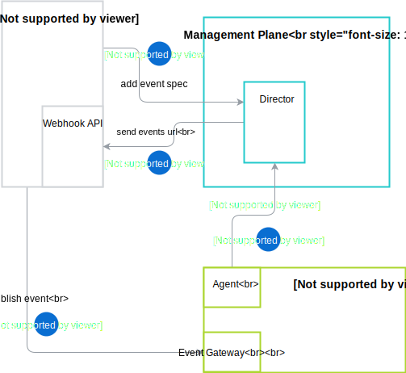
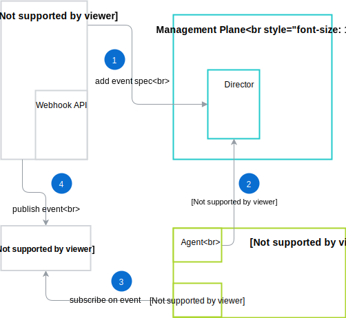

# Eventing flow proposal

## Overview

This document shows a proposal of two ways of eventing flow we want to support with use of the [Management Plane](./terminology.md#management-plane)

## Eventing with Kyma internal Event Bus



1. The event is registered using **Management Plane** API.
2. The **Director** sends an event url to Application.
3. The **Agent** fetches the event data and passes it to Kyma Event Bus through Event Gateway. It will support multiple protocols like HTTP, MQTT along with multiple authentication (e.g. OpenID Connect) and authorization (e.g. OAuth2) methods.  
4. The Application publishes an event.

## Eventing with external Event Bus



1. The event is registered using **Management Plane** API with external event bus data.
2. The **Agent** fetches the event and passes information to eventing system (E.g Google's Cloud PubSub).
3. Eventing system subscribes on external event bus.
4. The application publishes an event.

## GraphQL Schema  

### Types
```graphql

type EventAPIDefinition {
    id: ID!
    """group allows you to find the same API but in different version"""
    group: String
    spec: EventSpec!
    protocol: Protocol
    auth: Auth
    subscriptions: [EventSubscription!]!
    version: Version
}

enum Protocol {
  MQTT,HTTP,NATS
}

type EventSpec {
    data: CLOB
    type: EventSpecType!
    format: SpecFormat
    fetchRequest: FetchRequest
}

type EventSubscription {
    url: String!
    auth: Auth
    topic: String!
    attributes: EventSubscriptionAttributes
}
```

### Input Types

```graphql

input EventDefinitionInput {
    spec: EventSpecInput!
    group: String
    protocol: Protocol
    auth: AuthInput
    subscriptions: [EventSubscriptionInput!]
    version: VersionInput
}

input EventSpecInput {
    data: CLOB
    eventSpecType: EventSpecType!
    fetchRequest: FetchRequestInput
}

input EventSubscriptionInput {
    url: String!
    auth: AuthInput
    topic: String!
    attributes: EventSubscriptionAttributes
}
```