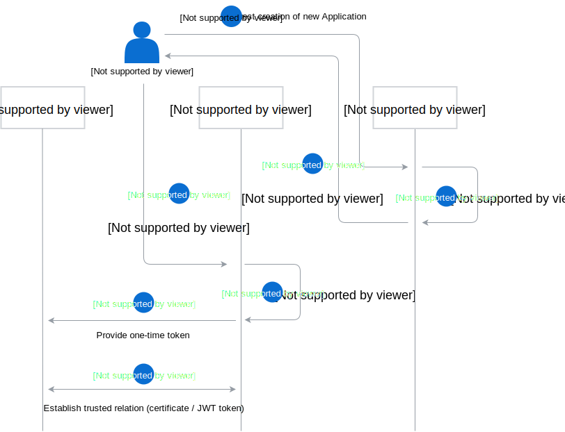
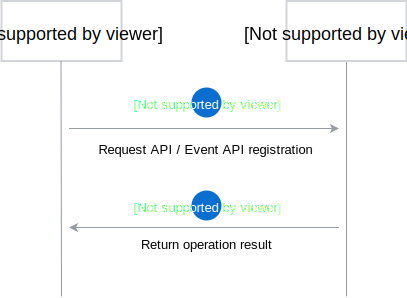
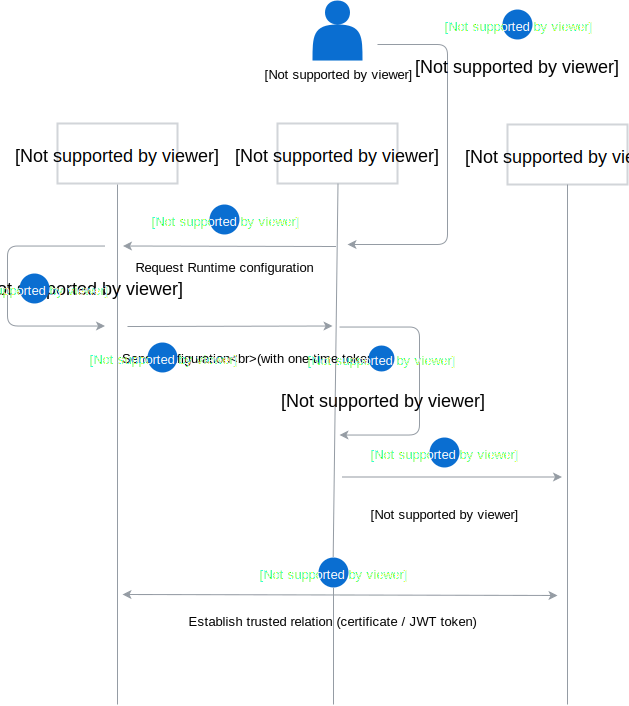
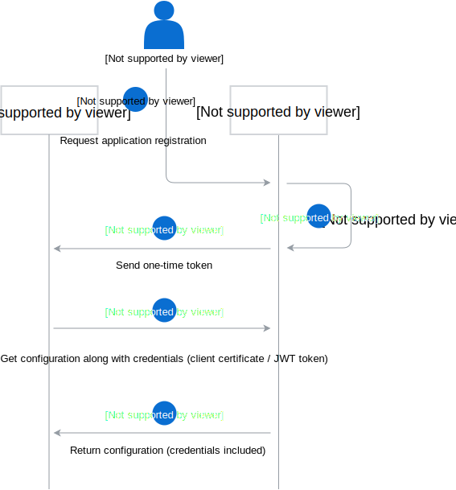
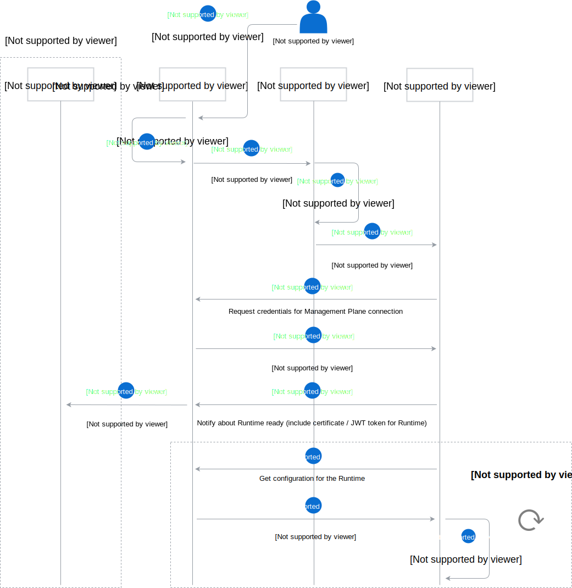

# Flow diagrams

The following diagrams shows interactions between Application, Management Plane and Runtime.

## Application connection

Application connection consists of two phases: Application pairing and API registration. In the process of connecting new Application, two Management Plane's components are involved: Director and Connector.

### Application pairing phase

Application pairing phase is a process of creating new Application in Management Plane's registry and establishing trusted connection between Application and Management Plane. 

Administrator requests Director to create a new Application in the registry. Director sends back Application details, along with its unique ID. Then, Administrator requests Application pairing to the Connector. Connector generates one-time token, and sends it to the Application. Application uses this token to establish a trusted relation between Application and Management Plane.

To learn about implementation details of the pairing process, see the [Application Connector diagram](https://kyma-project.io/docs/components/application-connector#architecture-connector-service).

### API registration phase

API registration phase is a process of registering new API and Event API definitions. Application requests API or Event API registration and receives operation result.

## Runtime creation

To create a new Runtime, Administrator sends proper request to the Runtime Provisioner. Runtime Provisioner requests Runtime configuration from Director, and one-time token from Connector. Runtime Provisioner provisions Runtime, and then injects the configuration with one-time token. Runtime uses this token to set-up trusted connection between Management Plane and Runtime.

## Application and Runtime configuration updates

TODO

If Runtimes assigned to a group of applications has been modified, Application is notified via webhook that new configuration details are available.

Runtime gets configuration details from Management Plane, including application list with theirs credentials, and applies the configuration asynchronously. Runtime checks periodically for new configuration details and applies them, if they changes.

-----

TODO: Terminology

## Application registration flow

Application registration begins with Administrator's request to the Management Plane. Management Plane generates one-time token, and sends it to the application. The one-time token is used to set-up trusted connection between Application and Management plane. Next, Application periodically pulls Runtime configuration details, such as `eventURL`.

If there are any changes in Application grouping, Application is notified via webhook that new configuration details are available. To learn about the notification flow, see the [Runtime creation flow](#runtime-creation-flow) diagram.

## Runtime creation flow

To create a new Runtime, Administrator sends proper request to the Management Plane. Management Plane generates one-time token and passes it, along with other Runtime configuration details, to the Runtime Provisioner. Runtime Provisioner provisions Runtime, and then injects the one-time token. Runtime uses this token to set-up trusted connection between Management Plane and Runtime. Next, Runtime notifies Management Plane, that the Runtime is ready.

When the Management Plane receives notification that a Runtime is ready, it passes the notification for every Application in group assigned to the Runtime via Application webhook.

In the meantime, Runtime gets configuration details from Management Plane, including application list with theirs credentials, and applies the configuration asynchronously. Runtime checks periodically for new configuration details and applies them, if they changes.

