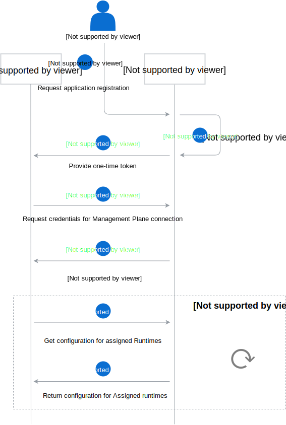

# Flow diagrams

The following diagrams shows Application registration and Runtime creation flows.

## Application registration flow

Application registration begins with Administrator's request to the Management Plane. Management Plane generates one-time token, and sends it to the application. The one-time token is used to set-up trusted connection between Application and Management plane and then to get runtime configuration details, such as `eventURL`.

## Runtime creation flow

To create a new Runtime, Administrator sends proper request to the Management Plane. Management Plane generates one-time token and passes it, along with other Runtime configuration details, to the Runtime Provisioner. Runtime Provisioner provisions Runtime, and then injects the one-time token. Runtime uses this token to set-up trusted connection between Management Plane and Runtime. Next, Runtime notifies Management Plane, that the Runtime is ready.

When the Management Plane receives notification that a Runtime is ready, it passes the notification for every Application in group assigned to the Runtime via Application webhook. In the meantime, Runtime gets configuration details from Management Plane, including application list with theirs credentials, and applies the configuration asynchronously.

g