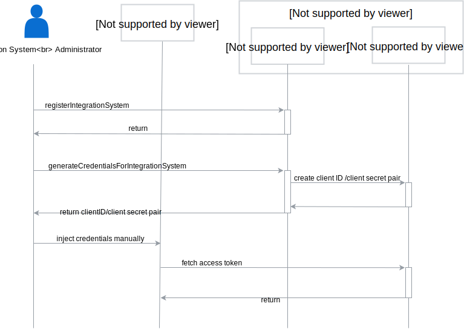

# Integration Systems 

Integration System is any system that works in the context of multiple tenants, managing multiple Applications or Runtimes. 
It exists in a global scope without a tenant assignment.
Thanks to introducing Integration System, Applications can be completely unaware of Compass, where all 
integration between Application and Compass is managed by the Integration System.

## GraphQL API Changes

GraphQL API is extended with mutations for managing Integration System, as well as 
managing its Client Credentials.
```
type IntegrationSystem {
    id: ID!
    name: String!
    auths: [SystemAuth!]!
}

input IntegrationSystemInput {
    name: String!
    description: String
}

type Mutation {
    createIntegrationSystem(in: IntegrationSystemInput!): IntegrationSystem!
    updateIntegrationSystem(id: ID!, in: IntegrationSystemInput!): IntegrationSystem!
    deleteIntegrationSystem(id: ID!): IntegrationSystem! 
    
    generateClientCredentialsForIntegrationSystem(id: ID!): SystemAuth!
    deleteSystemAuthForIntegrationSystem(id: ID!): SystemAuth!
}

type Query {
    integrationSystems(first: Int = 100, after: PageCursor): IntegrationSystemPage!
    integrationSystem(id: ID!): IntegrationSystem
}
```

## Workflows
The diagram below represents registering IntegrationSystem and pairing it with Director.



1. An Integration System Administrator executes mutation  `createIntegrationSystem` with the following input:
```
createIntegrationSystem(in:{name: "IntegrationSystemFromBigProvider"})
```

2. After creating IntegrationSystem, Administrator enables communication between IntegrationSystem and Director by
creating Client Credentials: `generateClientCredentialsForIntegrationSystem(integrationSystemID:ID!)`.
Director creates pair Client ID and Client Secret by requesting internal API of Hydra Admin and returns those pair to the 
Administrator.

3. The administrator manually configures Integration System to use previously generated Client ID and Client Secret
for communication with Compass. From that point, Integration System then can fetch access token and start communication
with Compass.