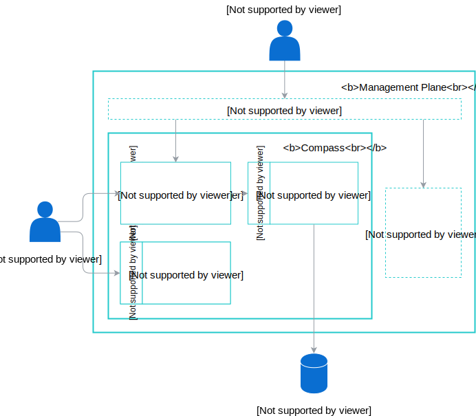

# Management Plane Components

## Overview

This document describes the Management Plane's components.

## Components

Management Plane consists of Compass, Runtime Provisioners, Service Mesh and UI components. Applications and Agents can communicate with the Gateway component or Connector component. Admin uses UI to configure Management Plane.

### Compass

Compass component consists of three components: Connector, Gateway, and Director.

#### Connector

Connector component exposes GraphQL API that can be accessed directly, its responsibility is establishing trust among Applications, Management Plane and Runtimes.

#### Gateway

Gateway component serves as the main API Gateway that extracts token from incoming requests and proxies the requests to the Director component.

#### Director

Director component exposes GraphQL API that can be accessed through the Gateway component. It contains all business logic required to handle Applications and Runtimes registration. It also requests Application Webhook API for credentials. This component has access to external to storage.

### UI

UI component calls Management Plane APIs. This component is interchangeable.

### Service Mesh

Service Mesh component serves as an infrastructure layer allowing communication between services. This component is interchangeable.

### Runtime Provisioner

Runtime Provisioner handles the creation, modification, and deletion of Runtimes. This component is interchangeable.
