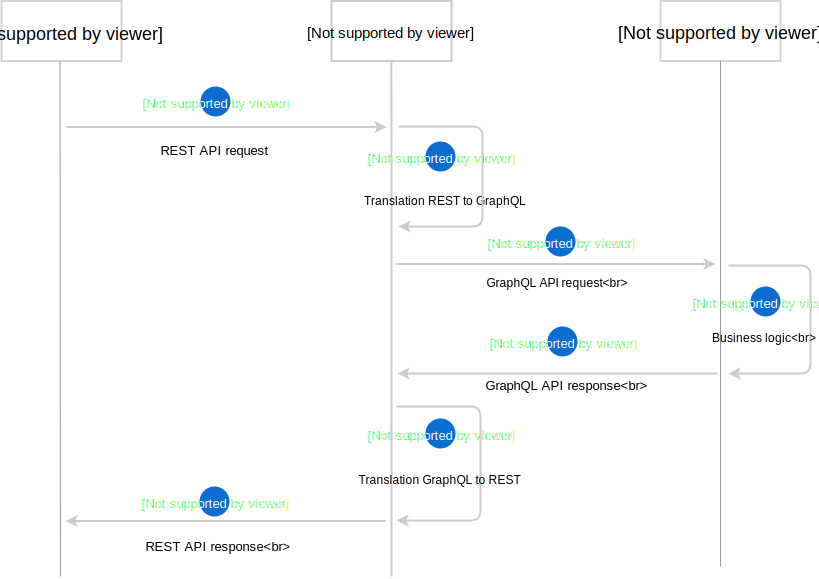

# Support for legacy REST API

## Overview

This document describes the [Management Plane's](./../terminology.md#management-plane) support for legacy REST API.

## Description

To allow a smooth transition from the current approach for working with external [Applications](./../terminology.md#application), [Compass](./../terminology.md#mp-compass) provides legacy support for the REST API to connect and register Applications. Calls to the [Director](./../terminology.md#mp-director) and [Connector](./../terminology.md#mp-connector) can be done using new GraphQL API or legacy REST API. Internally calls to the REST API are translated by the [Gateway](./../terminology.md#mp-gateway) to the GraphQL format and forwarded to the desired component.

## Flow diagram

Following diagram shows the flow when dealing with calls to REST API that are translated by the Gateway and then forwarded to the desired component. This applies for the calls to the Connector and Director, so both [pairing phase](./app-runtime-flows.md#application-pairing-phase) and [registration phase](./app-runtime-flows.md#api-registration-phase) are covered.

### Calling REST API flow

