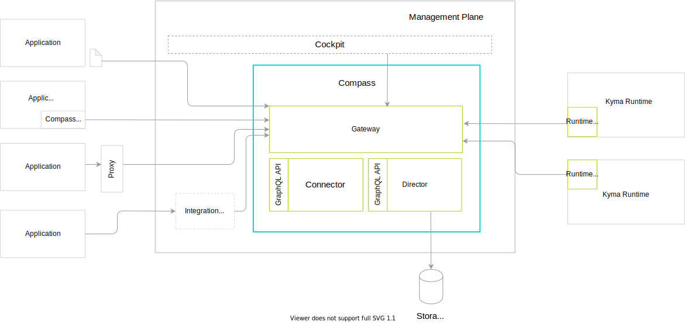

# Components

These are the components related to Compass:

## Application/System

Application represents any external system that you want to register to Compass with its API and Event definitions. These are the types of possible integration levels between an Application and Compass:
- Manual integration - the Administrator manually provides API or Events metadata to Compass. Use this type of integration for simple use-case scenarios as it does not support all features.
- Built-in integration - integration with Compass is built in the Application.
- Proxy - a highly Application-specific proxy component provides the integration.
- [Integration System](#integration-system) - a central service provides integration for the dedicated group of Applications across multiple tenants. It manages multiple instances of the given Application type. You can integrate multiple Integration Systems to support different types of Applications.
- Discovery - the system can be fetched from an external systems registry

## Management Plane

Management Plane is the cluster on which all Compass components are deployed.

## Kyma Runtime

Runtime is a system to which you can apply configuration provided by Compass. Your Runtime must get a trusted connection to Compass. It must also allow for fetching Application definitions and using these Applications in one-tenant scope. By default, Compass is integrated with Kyma (Kubernetes), but its usage can also be extended to other platforms, such as CloudFoundry or Serverless.

## Runtime Agent

Runtime Agent is an integral part of every Runtime and it fetches the latest configuration from Compass. It also provides Runtime specific information that is displayed in the Compass UI, such as Runtime UI URL, and it provides Compass with Runtime configuration, such as Event Gateway URL, that should be passed to an Application. In the future releases, Runtime Agent will send Runtime health checks to Compass.

An example of Runtime Agent implementation is the [Kyma Compass Runtime Agent](https://github.com/kyma-project/kyma/tree/main/components/compass-runtime-agent).

## Compass Console

The Compass Console is a UI that calls Compass APIs. This component is interchangeable.

## Gateway

Gateway proxies the tenant's incoming requests to the Director and Connector components. All communication, whether it comes from an Application or other external components, flows through Gateway.

The Gateway components takes care of audit logging all create, update, and delete operations on Compass resources.

## Connector

Connector establishes trust between Applications and Runtimes. Currently, only client certificates are supported.

It also takes care of verifying externally issued client certificates - those are certificates which were not issued by Connector itself, but are still trusted to call Compass.

## Director

Director handles the process of managing Applications and Runtimes. It also requests Application webhook APIs for credentials and exposes health information about Runtimes. This component has access to the storage.

## Integration System

Integration System is any system that provides integration for multiple tenants. It exists in a global scope without tenant assignment.
See [Integration Systems document](../integration-system/integration-systems.md)
for more details.

## Application Template
Represents an object for creating Applications from predefined static definition.
See [Automatic Application Management document](../integration-system/auto-app-management.md)
for more details.

## Operations Controller

The Operations Controller is responsible for any asynchronous operations triggered in Compass, e.g. application deletion - if you want to unregister an application, you would also want to delete all related application credentials. If the application has a delete webhook, then Director should call it before removing the application from its database.

When the Operation Controller is done with processing the asynchronous request, it calls Director to let it know that the operation can be finalized (e.g. if it's application unregister, then the application can be deleted from the Director DB).

## System Fetcher

The System Fetcher component takes care of discovering existing applications (systems) in an external provider system which supports the same tenancy model and can be used for querying applications for a given tenant.

## ORD Service

The Open Resource Discovery (ORD) Service is an OData V4 API exposing information about applications, their APIs and events.
It is developed in a separate GitHub repository, and any additional details can be found [there](https://github.com/kyma-incubator/ord-service).

## ORD Aggregator

ORD Aggregator takes care of gathering APIs and events of applications, which are registered with a so called ORD webhook. It is used for automatic discovery of APIs and events without explicit need for the application to register its own resources in Compass.

## Tenant Fetcher (_Job_ and _Deployment_)

The Tenant Fetcher components are responsible for managing tenants in Compass.
The Tenant Fetcher job periodically fetches tenant events (for creation and deletion) from an external tenants service, and applies the according changes in Compass.

The Tenant Fetcher deployment takes care for creating tenants when an external tenancy manager calls it.
It is also responsible for providing access to a given tenant to a particular multi-tenant runtime.

## System Broker

The System Broker exposes an [Open Service Broker (OSB) API](https://www.openservicebrokerapi.org/) as well as an endpoint for fetching application specifications. More details regarding the component can be found in its [documentation](https://github.com/kyma-incubator/compass/tree/main/components/system-broker).
