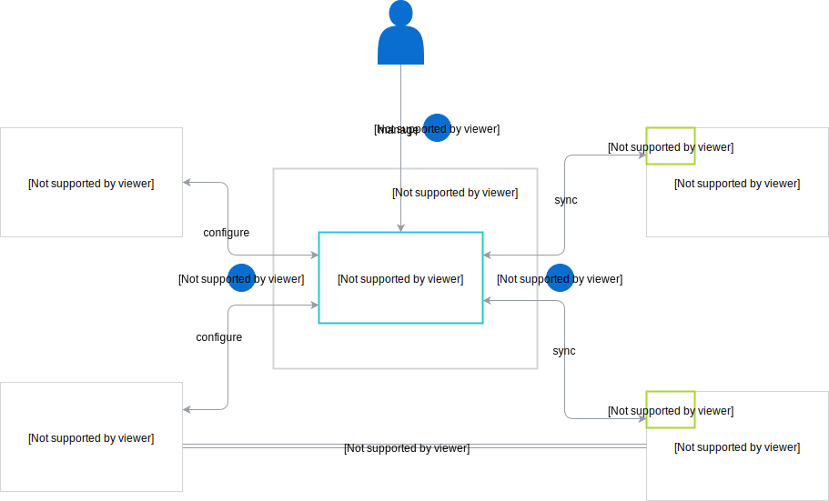
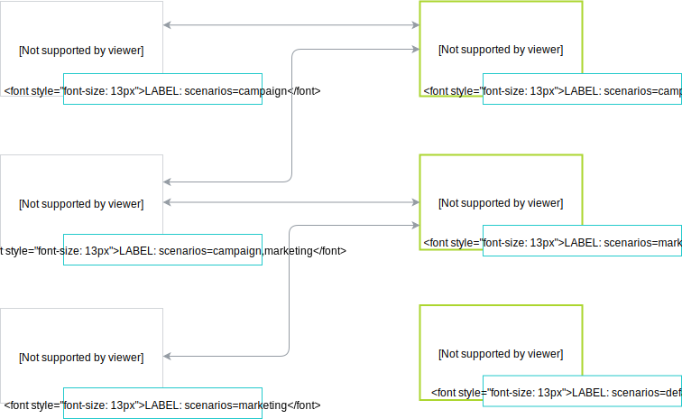

# Basic Architecture

The diagram presents the basic workflow between Applications, Runtimes, and Compass:

1. Administrator adds Runtimes and Applications, and configures them using Compass.
2. Runtime Agent continuously fetches the latest configuration from Compass.
3. If an Application has optional webhooks configured, Compass notifies an Application about any Events that concern the given Application.

Compass by design does not participate in direct communication between Applications and Runtimes. It only sets up the connection. After establishing a trusted connection between an Application and a Runtime, they communicate directly with each other.

## Scenarios

In order to connect and group your Applications and Runtimes, assign them to the same scenario.
A scenario is a simple label with the **scenarios** key. If an Application is not explicitly assigned to any scenario, it belongs to the `default` one. The Application is automatically removed from the `default` scenario after you assign it to any other scenario. By default, Runtimes are not assigned to any scenario. You can assign Applications and Runtimes to multiple scenarios. See the example:

`Application 2` belongs to the `campaign` and `marketing` scenarios. Assuming that `Application 2` only exposes APIs, you can assign both `Runtime 1` and `Runtime 2` to it. However, if `Application 2` also exposes Events, you can assign it only to one Runtime. If you try to connect more Runtimes, Compass will not allow you to do so. Communication between components that do not belong to the same scenario, such as `Application 3` and `Runtime 1`, is not possible.