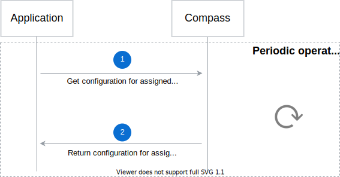
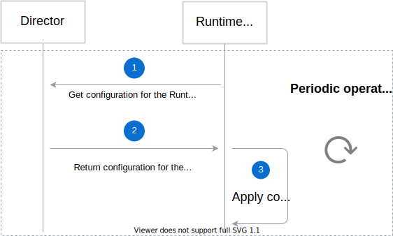

# Interactions between Application, Runtime, and Compass

The basic flow of interactions between Application, Compass and Runtime is as follows:
1. Connecting Application
2. Registering Runtime
3. Changing configuration

## Connecting Application

Application connection consists of two phases: Application pairing and API registration. In the process of connecting a new Application, two Compass components are involved: Director and Connector.

### Application pairing phase

Application pairing phase is a process of creating a new Application and establishing a trusted connection between Application and Compass. The workflow looks as follows:

1. Administrator sends a request to register a new Application in Compass.
2. Director registers a new Application.
3. Director sends back Application details, along with its unique ID.
4. Administrator requests Application pairing to the Connector.
5. Connector generates a one-time token and sends it back to the Administrator.
6. Administrator passes the one-time token to the Application.
7. Application uses this token to establish a trusted relation between Application and Compass.

### API registration phase

API registration phase is a process of registering new API and Event definitions, which consists of two steps:

1. Application sends a request to register API or Event definition to the Director component.
2. Director returns the operation result to the Application.

## Registering Runtime

The process of registering a new Runtime looks as follows:

1. Administrator sends a request to provision a new Runtime.
2. Runtime Provisioner requests Runtime configuration from the Director.
3. Director returns Runtime configuration to Runtime Provisioner.
4. Runtime Provisioner requests a one-time token from the Connector component.
5. Connector generates a one-time token for the Runtime.
6. Connector returns the token to Runtime Provisioner.
7. Runtime Provisioner provisions a Runtime.
8. Runtime Provisioner injects Runtime configuration along with the one-time token. (?)
9. Runtime Agent uses the token to set up a trusted connection between Compass and Runtime.

When the Runtime is ready, Runtime Agent notifies the Director about the Runtime status. When the Director receives notification that a Runtime is ready, it passes the notification for every Application in a group assigned to the Runtime using Application Webhook API.

## Changing configuration

The following section describes how configuration updates work for Applications and Runtimes.

### Application configuration update

There are two options for updating Application configuration:
- Periodically fetching Application configuration
- Exposing Application Webhook API to get notifications on configuration updates

In the first case, Application periodically pulls configuration details, such as **eventURL**, for connected Runtimes.

In the second case, if any connected Runtime configuration changes, Application Webhook API notifies an Application that new configuration details are available. The following diagram shows the interaction between Runtime Agent, Director and Application when a new Runtime is configured successfully:

1. Runtime Agent sends a request to change Application configuration.
2. Director notifies the Application about the request.
3. application changes configuration for Runtime.
4. Runtime Agent gets a new configuration from the Director.

### Runtime configuration update

Runtime Agent gets Runtime configuration details from the Director and applies the configuration asynchronously. The configuration details include information such as the list of Applications and their credentials. Runtime Agent periodically checks for new configuration details and applies the changes.

