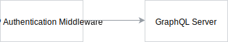

# Security

There are multiple ways you can access Compass from security perspective. The Compass component supports the following ways of authentication: 
 - OAuth 2.0
 - Client certificates (mTLS)
    - Issued by the Compass Connector
    - Issued by external certificate authority
 - JSON Web Token (JWT) issued by identity service
 - One-time token
 
Additionally, there are **two consumer-provider** flows, in which an external multi-tenant system wants to manage resources (for example, bundle instance auths) on behalf of a tenant in Compass. These are the following:
 - SaaS applications, which are modeled like runtimes, can access Compass resources with an externally-issued certificate, and a JWT where the provider tenant is present.
 - Integration systems, which are configured with externally-issued certificate, can once again consume resources from tenants which are provided as a `Tenant` header.

Compass is integrated with [ORY Hydra](https://www.ory.sh/hydra/) and [ORY OathKeeper](https://github.com/ory/oathkeeper).

## Architecture

The following diagram represents the architecture of the security in Compass:


### Tenant Mapping Handler

The Tenant Mapping Handler is an Oathkeeper [hydrator](https://github.com/ory/docs/blob/525608c65694539384b785355d293bc0ad00da27/docs/oathkeeper/pipeline/mutator.md#hydrator) handler that is responsible for mapping authentication session data to the tenant. It is part of the Hydrator component and communicates with the Director through the GraphQL API.

To unify the mapping approach, it is introduced an Authorization ID `auth_id`, which is used across the multiple authentication flows. Each authentication flow has its own context provider, which takes care of extracting information about the tenant and the granted scopes.

Depending on the use case, the `auth_id` equals to:
- Parameter `client_id` in the OAuth 2.0 authentication flow.
- Client ID in the one-time token authentication flow.
- Common Name (CN) in the Connector-issued certificates authentication flow.
- External Tenant ID of type `Subaccount` for externally-issued certificates flow, extracted from the certificate's organizational unit (OU) by default.

The `system_auths` table is used for tenant mapping. An entry in the `system_auths` table in the Director database is created while generating one of the following:
- An one-time token;
- A `client_id`-`client_secret` pair;
- A client certificate, issued by Connector for Runtime/Application/Integration System by using a proper GraphQL mutation in the Director.

In the certificate's authentication flows (Connector-issued and externally-issued certificates), the Tenant Mapping Handler puts fixed `scopes` into an authentication session. The `scopes` are fixed in the code and they depend on the type of the calling object (Application/Runtime/Integration System). They are listed in the [config.yaml](https://github.com/kyma-incubator/compass/blob/1105695797f74eba8d8a86ee3d4d65809ef6abb7/chart/compass/charts/director/config.yaml#L120) file.

In the identity service flow, where JWT is used, the `scopes` are loaded from a ConfigMap, where a static `user_group: scopes` mapping is set. The user group is present in the JWT.

#### `system_auths` table

The table is used by the Director and Tenant Mapping Handler. It contains the following fields:
- `id` - This is the `authorization_id`.
- `tenant` - An optional field, used for Application and Runtime, and not used for Integration System.
- `app_id` - A foreign key of type UUID
- `runtime_id` - A foreign key of type UUID
- `integration_system_id` - A foreign key of type UUID
- `value` - A field of type JSON, with authentication details, such as, a `client_id`-`client_secret` in the OAuth 2.0 authentication flow, a Common Name in case of the certificates flow, or a token in the one-time-token flow.

#### Custom Authenticator
You can configure a custom JWT-based authentication for Compass with trusted issuers and locations for a tenant and scopes in the token. The flow is as follows:
1. The authentication-mapping handler hydrator first checks for trusted issuer, next enriches, and then, provides the tenant-mapping handler with locations for tenant, scopes, and clientID.
1. The tenant-mapping handler extracts them from the token's claims and verifies that the tenant exists.

#### Consumer-Provider Flows
As mentioned above, there are use cases where you can manage Compass resources from a different multi-tenant system, which shares the same tenancy model and knows the external tenant IDs, which are also used by Compass. In this case, Compass trusts those systems and allows them to manage resources on behalf of the user. The following options are valid for this flow:
- The multi-tenant system is represented as an Integration System. In this case, the consumer tenant is specified in the `Tenant` header. The scopes which are granted to the request, are the ones assigned to integration systems, by default. They are granted by the context provider, mentioned above.
- The multi-tenant system is represented as a Runtime. In this case, the second context provider that matches is a custom authenticator, where the consumer tenant is part of a JWT, along with the scopes that are granted. The scopes are taken from the context provider in this case.

Both cases feature two context providers, which are used in a pair. One of context providers must be an externally-issued certificate context provider. It extracts the provider tenant ID from the certificate. Later on, Compass checks if the provider tenant has access to the consumer tenant. For more information, see the [Authentication Flows](03-01-security.md#authentication-flows) section in this document.

### GraphQL security

The Gateway passes the request to Compass GraphQL services, such as the Director or the Connector. Additionally, the request contains authentication data. In the Director it is a JWT token, in the Connector it is the `Client-Id-From-Token` header or the `Client-Id-From-Certificate` and `Client-Certificate-Hash` headers. The GraphQL components have authentication middleware and GraphQL [directives](https://graphql.org/learn/queries/#directives) set up for all GraphQL operations (and some specific type fields, if necessary). 

#### HTTP middleware

In GraphQL servers, such as the Director or the Connector, there is an HTTP authentication middleware set up. In the Director, it validates and decodes the JWT token, and puts user scopes and the tenant in the request context
(`context.Context`). In the Connector, it verifies the `Client-Id-From-Token` header or the `Client-Id-From-Certificate` and `Client-Certificate-Hash` headers.



#### GraphQL Directives

When GraphQL operation is processed, an authorization directive is triggered, before actual GraphQL resolver. It checks if the client has required scopes to perform the requested operation. To avoid defining permissions statically in the GraphQL schema, a YAML file is loaded with needed requests. In fact, it is a ConfigMap injected to the Director/Connector.

The following example illustrates how we can implement dynamic comparison between required scopes and request scopes for example mutations, queries, and type fields:

```graphql

type Mutation {
    createApplication(in: ApplicationInput!): Application! @secureWithScopes(path: "mutations.createApplication")
    updateApplication(id: ID!, in: ApplicationInput!): Application! @secureWithScopes(path: "mutations.updateApplication")
    deleteApplication(id: ID!): Application @secureWithScopes(path: "mutations.deleteApplication")
}


type Query {
    runtimes(filter: [LabelFilter!], first: Int = 100, after: PageCursor): RuntimePage! @secureWithScopes(path: "queries.runtimes")
    runtime(id: ID!): Runtime @secureWithScopes(path: "queries.runtime")
}

type Application {
    id: ID!
    name: String!
    description: String
    labels(key: String): Labels!
    status: ApplicationStatus!
    webhooks: [Webhook!]! @secureWithScopes(path: "types.Application.webhooks")
    healthCheckURL: String
    apis(group: String, first: Int = 100, after: PageCursor): APIDefinitionPage! @secureWithScopes(path: "types.Application.apis")
    eventAPIs(group: String, first: Int = 100, after: PageCursor): EventAPIDefinitionPage! @secureWithScopes(path: "types.Application.eventAPIs")
    documents(first: Int = 100, after: PageCursor): DocumentPage! @secureWithScopes(path: "types.Application.documents")
}
```

Instead of manually defining these directives in the GraphQL schema, we can automate it using [gqlgen](https://gqlgen.com/reference/plugins/) plugins.

The `path` parameter specifies the path in the YAML file (ConfigMap) with required scopes for a given resolver. For example:
```yaml
queries:
    runtimes: "runtime:view"
    runtime: "runtime:view"
mutations:
    createApplication: "application:admin"
    updateApplication: "application:admin"
    deleteApplication: "application:admin"
types:
    Application:
        webhooks: "webhook:view"
        apis: "api:view"
        eventAPIs: "eventapi:view"
        documents: "document:view"
```

The actual scopes will be defined later.

#### Limiting Application/Runtime modifications

Application/Runtime shouldn't be able to modify other Applications or Runtimes. In the future, to limit the functionality, we will introduce another GraphQL directive.

```graphql
type Mutation {
    updateApplication(id: ID!, in: ApplicationInput!): Application! @secureWithScopes(path: "mutations.updateApplication") @limitModifications(type: APPLICATION, idParamName: "id")
}
```

The `limitModifications` mutation compares ID provided for the `updateApplication` mutation with Application ID saved in the context by Tenant Mapping Handler.

## Authentication flows

Each authentication flow is handled on a separate host via different VirtualService, as currently OathKeeper doesn't support certificates and multiple `Bearer` authenticators.

### OAuth 2.0 Access Token

**Used by:** Integration System / Application / Runtime

There are two ways of creating a `client_id` and `client_secret` pair in the Hydra, using Hydra's [oauth client](https://github.com/kyma-project/kyma/blob/ab3d8878d013f8cc34c3f549dfa2f50f06502f14/docs/security/03-06-oauth2-server.md#register-an-oauth2-client) or [simple POST request](https://github.com/kyma-incubator/examples/tree/main/ory-hydra/scenarios/client-credentials#setup-an-oauth2-client).

**Obtaining token:**

1. Runtime/Application/IntegrationSystem requests the `client_id` and `client_credentials` pair from the Director by a separate GraphQL mutation. the Director generates the pair, registers it in Hydra with proper scopes (defined by object type), and writes it to the database.
1. Runtime/Application/IntegrationSystem calls Hydra with encoded credentials (`client_id` is the ID of the `SystemAuth` entry related to the given Runtime/Application/IntegrationSystem) and requested scopes.
1. If the requested scopes are valid, Runtime/Application/IntegrationSystem receives an access token in response. Otherwise, it receives an error.

**Request flow:**

1. ORY Oathkeeper authenticator calls Hydra for introspection of the token.
1. If the token is valid, Oathkeeper sends the request to ORY mutator hydrator.
1. Mutator hydrator calls Tenant Mapping Handler hosted by the `Hydrator` component to get `tenant` based on a `client_id`. The `client_id` is the ID of `SystemAuth` entry related to the given Runtime/Application/IntegrationSystem.
1. Tenant Mapping Handler calls the `Director` using GraphQL API.
1. Hydrator component passes response to ID_Token mutator, which constructs a JWT token with scopes and `tenant` in the payload.
1. Then, the request is forwarded to the desired component (such as `Director` or `Connector`) through the `Gateway` component.


**Scopes**

In this authentication flow, scopes are read from OAuth 2.0 access token and written directly in output JWT token. Hydra validates if user can request access token with given scopes.

**Proof of concept:** [kyma-incubator/compass#287](https://github.com/kyma-incubator/compass/pull/287)

### JWT token issued by identity service

**Used by:** User

**Obtaining token:**

User logs in to Compass UI

**Request flow:**

1. ORY Oathkeeper authenticator validates the token using keys provided by the identity service. 
2. If the token is valid, Oathkeeper sends the request to ORY mutator hydrator.
3. Mutator hydrator calls Tenant Mapping Handler hosted by the `Hydrator` component.
4. Tenant Mapping Handler calls `Director` using GraphQL API which, in production environment, returns **the same** authentication session (as the `tenant` is already in place) even for local development. For more information on how to configure OIDC Authentication Server, see [Installation](https://github.com/kyma-incubator/compass/blob/main/docs/compass/04-01-installation.md#local-minikube-installation).
5. Hydrator component passes response to ID_Token mutator which constructs a JWT token with scopes and `tenant` in the payload.
6. The request is then forwarded to the desired component (such as `Director` or `Connector`) through the `Gateway` component.


**Scopes**

The scopes are loaded from a ConfigMap, where static `user group` - `scopes` mapping is set.

**Example ConfigMap**

```yaml
kind: ConfigMap
apiVersion: v1
metadata:
   name: compass-hydrator-static-groups
   namespace: compass-system
data:
   static-groups.yaml: |
      - groupname: "application-superadmin"
        scopes:
          - "application:read"
          - "application:write"
          - "application.auths:read"
          - "application.webhooks:read"
```

### Client certificates

**Used by:** Runtime/Application

**Compass Connector flow:**

1. Runtime/Application makes a call to the Connector to the certificate-secured subdomain.
1. Istio verifies the client certificate. If the certificate is invalid, Istio rejects the request.
1. Oathkeeper mutator hydrator sends the request to the Certificate resolver hosted by the `Hydrator` component, where the certificate info (subject and certificate hash) is extracted from `Certificate-Data` header, populated by istio envoy filter. Then, `Client-Certificate-Hash` and `Client-Id-From-Certificate` headers are populated. If the certificate has been revoked, the two headers will be empty.
1. The request is forwarded to the Connector through the Compass `Gateway`.


**Compass Director Flow:**

1. Runtime/Application makes a call to the Director to the certificate-secured subdomain.
1. Istio verifies the client certificate. If the certificate is invalid, Istio rejects the request.
1. Oathkeeper mutator hydrator sends the request to the Certificate resolver hosted by the `Hydrator` component, where the certificate info (subject and certificate hash) is extracted from `Certificate-Data` header, populated by istio envoy filter. Then `Client-Certificate-Hash` and `Client-Id-From-Certificate` headers are populated. If the certificate has been revoked, the two headers will be empty.
1. The call is proxied again to the `Hydrator` component and to the Tenant Mapping Handler where the `client_id` is mapped onto the `tenant` and returned to the Oathkeeper. If the Common Name is invalid, the `tenant` will be empty.
1. Oathkeeper passes the response to ID_Token mutator, which constructs a JWT token with scopes and tenant in the payload.
1. The Oathkeeper proxies the request further to the Compass `Gateway`.
1. The request is forwarded to the `Director`.


**Scopes**

The scopes are added to the authentication session in Tenant Mapping Handler. The handler gets not only `tenant`, but also `scopes`, which are defined per object type (Application / Runtime). 

### Externally-issued client certificates

**Used by:** Runtime/Integration System

**Compass Director Flow:**

1. Runtime/Application makes a call to the Director via an externally-issued client certificate on a certificate-secured endpoint of Compass. Compass is configured to trust externally-issued client certificates on that endpoint.
1. Istio verifies the client certificate. If the certificate is invalid, Istio rejects the request.
1. The certificate info (subject and certificate hash) is added to the `Certificate-Data` header.
1. The Oathkeeper uses the Certificate Resolver as a mutator, which turns the `Certificate-Data` header into the `Client-Certificate-Hash` header and the `Client-Id-From-Certificate` header. If the certificate has expired, the two headers are set empty. Additionally, if the subject matches one of the subjects in a predefined configuration, then, an `extra` field is added to the *Auth Session*. The `extra` field contains a consumer type (integration system), access levels (contains a set of tenant types, which the provider tenant can access, for example, `account` only), and an optional internal consumer ID, which can be the GUID of an existing integration system.
1. The Certificate Resolver also sets the Authentication ID (`auth_id`) to one of the OUs in the subject. If there are many OUs, Hydrator component can be configured to skip some of them. The auth ID represents the external ID of a tenant of type `subaccount`.
1. Then, the call is proxied to the Tenant Mapping Handler, where:
   1. In case of a static match to an externally-issued certificate, the `Tenant` header is mapped to a `tenant`.
   2. Otherwise, the `auth_id` is mapped to the `tenant`.
   3. If the tenant does not exist, an empty tenant info is returned.
1. Hydrator passes the response to ID_Token mutator, which constructs a JWT token with scopes and tenant in the payload.
1. The OathKeeper proxies the request further to the Compass Gateway.
1. The request is forwarded to the Director.

The diagram for the client certificate above outlines this case, too.

**Scopes**

The scopes are added to the authentication session in Tenant Mapping Handler. The handler gets not only the `tenant`, but also `scopes`, which are defined per object type (Application or Runtime). The default type is *Runtime*.

### One-time token

**Used by:** Runtime/Application

**Connector flow:**

1. Runtime/Application makes a call to the Connector's internal API.
1. Oathkeeper mutator hydrator sends the request to the Token resolver hosted by the `Hydrator` component. It extracts the Client ID from the one-time token's `Connector-Token` header or from the `token` query parameter, and writes it to the `Client-Id-From-Token` header. In the case of failure, the header is empty.
1. The Oathkeeper proxies the request further to the Compass `Gateway`.
1. The request is forwarded to the `Connector`.


**Director Flow:**

1. Runtime/Application makes a call to the Director.
1. Oathkeeper mutator hydrator sends the request to the Token resolver hosted by the `Hydrator` component. The Client ID is extracted from the one-time token's `Connector-Token` header or from the `token` query parameter, and is then written to the `Client-Id-From-Token` header. In the case of failure, the header is empty.
1. Then, the call is proxied again to the Tenant Mapping Handler mutator hosted by the `Hydrator` component, where the Client ID is mapped onto the `tenant` and returned to the Oathkeeper. 
1. Oathkeeper passes the response to ID_Token mutator which constructs a JWT token with scopes and tenant in the payload.
1. The OathKeeper proxies the request further to the Compass `Gateway`.
1. The request is forwarded to the `Director`.


**Scopes**

The scopes are added to the authentication session in Tenant Mapping Handler. The handler gets not only the `tenant`, but also `scopes`, which are defined per object type (Application or Runtime).

### Consumer-provider flow

**Used by:** Runtime/Integration System

##### Integration Systems
An integration system is any multi-tenant application, which has access to all tenants available in Compass.
The Integration Systems either can use OAuth credentials for authentication (created via the `requestClientCredentialsForIntegrationSystem` mutation), or a client certificate, issued by an external issuer, which is trusted by Compass.

The latter authentication mechanism is plugged into Compass Hydrator. It can be configured to trust a specific certificate subject and based on that subject, to set the Consumer type to _Integration System_, and grant it access to a set of tenant types. This mechanism is more restrictive than the one that uses OAuth client.
The consumer tenant is specified in the `Tenant` header.

**Compass Director Flow:**

The flow is the same as the flow for externally issued certificate that was outlined before. The only difference is that the Tenant Mapping handler matches two object context providers. Hence, the tenants in this request are 4 in total: internal and external provider tenants, and internal and external consumer tenants.
If the provider tenant has access to the type of tenant the consumer belongs to, then the request is authorized successfully.

**Scopes**
Since there are two context providers, there are also two pairs of scope sets. One from the matched external certificate context provider and one from the access level context provider.
In this case, the scopes from the external certificate context provider (for consumer type Integration System) is taken into account.

##### Runtimes
Usually, Integration Systems access grants too many permissions and for this reason it must be provided carefully. Therefore, to achieve the required scenario results it was introduced more flexible and secured means for access provisioning. First, the multi-tenant applications are registered as a *special* runtime in Compass, having a special label, which Compass uses for distinguishing multi-tenant and ordinary runtimes.

When the multi-tenant system is represented as a Runtime, its tenant access is managed from an outside service. The service communicates with the Tenant Fetcher deployment, which calls Director component that is responsible to create a new entity. The entity is called runtime context. Its purpose is to manage the consumer data and to establish trust between the consumer and provider. It also grants the provider tenant access to the resources in the consumer tenant. The provider tenant is the tenant where the multi-tenant runtime is registered. The consumer tenant is of type `subaccount`. When the trust between the tenants is established, the external multi-tenant system can access resources in the consumer tenant.

**Compass Director Flow:**

_Not productive yet_

**Compass ORD Service Flow:**

_Used in production_

This flow is similar to the externally-issued certificate flow, too. Again, two context providers are matched. One with externally-issued certificate and one with a custom authentication with JWT. Compass validates that the provider tenant has access to the consumer tenant.

**Scopes**
The first context provider returns Runtime scopes and the second provider returns the scopes that are present in the JWT. The scopes that are returned by the context provider that uses JWT must be used.

## Internal Authentication

Compass has a separate security layer to take care of internal component communication, for example, from ORY Oathkeeper to Director. 

It is based on Istio `RequestAuthentications` and `AuthorizationPolicies` that require service account token from the caller as an additional X-Authorization header. The service account is bound to the source workload. The `RequestAuthentication` verifies that the token is correctly signed by the Kubernetes JWKS. 
The `AuthorizationPolicy` ensures that the routes, such as, `/healthz` are accessible without any authentication and all other routes require properly signed tokens.

Workloads that previously required some sort of authentication, for example, ORY Oathkeeper tokens for Director or one-time tokens for Connector, still require them as a separate header.


* Flows going through ORY Oathkeeper pass through an Envoy filter (matching outbound requests) that auto-injects the service account token in the request. This is secure because going through ORY successfully means that the request already has a valid authentication or authorization.
* Internal calls to Director require an ORY Oathkeeper token on top of the service account token. To simplify Director clients (such as Operations Controller), it has been introduced a new ORY Oathkeeper gateway (`gateway-int`) and a respective rule that accepts a service account token as Authorization header and produces an ORY Token with all the required scopes. Additionally, the Oathkeeper Envoy filter injects again the service account token as `X-Authorization` header when the call passes through Oathkeeper, so that the Istio Policy passes successfully.
