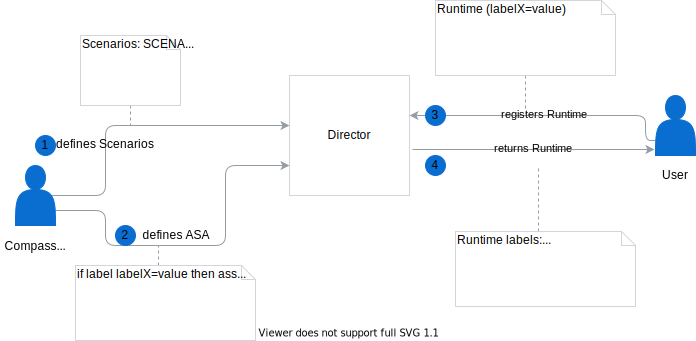

# Automatic Scenario Assignment

Automatic Scenario Assignment (ASA) feature allows you to define an external subaccount tenant ID, in which all Runtimes are assigned to the given scenario, assuming that the scenario is in a parent tenant of type `account`. 

 

1. Administrator defines Scenarios in a tenant of type `account`.
2. Administrator defines conditions to label Runtimes using Automatic Scenario Assignment. 
3. User registers a Runtime that matches the conditions specified in the ASA.
4. Runtime is automatically assigned to the matching Scenario. 

## API

Automatic Scenario Assignment is defined in the following way:
```graphql
type AutomaticScenarioAssignment {
   scenarioName: String!
   selector: Label!
}

type Label {
   key: String! 
   value: Any!
}

```

A tenant-matching condition is defined as a label selector in the `selector` field. This behaviour is intended for backwards compatability. Yet, the assignment is based on the tenant, in which the Runtime is created and not on the labels of the Runtime. The label key is validated to be a `global_subaccount_id`. It is also validated that the subaccount tenant is a child of the tenant, in which the scenario and the ASA resides. Then, if a Runtime is created in the `global_subaccount_id` tenant, that Runtime is automatically assigned to the given Scenario.

### Mutations

Director API contains the following mutations for managing Automatic Scenario Assignments:
```graphql
   createAutomaticScenarioAssignment(in: AutomaticScenarioAssignmentSetInput! @validate): AutomaticScenarioAssignment 
   deleteAutomaticScenarioAssignmentForScenario(scenarioName: String!): AutomaticScenarioAssignment 
   deleteAutomaticScenarioAssignmentsForSelector(selector: LabelSelectorInput! @validate): [AutomaticScenarioAssignment!]! 
```
When you create an assignment, make sure that the following conditions are met:
- Only one Assignment exists for a given Scenario.
- The given Scenario exists.
- The selector key is of type `global_subaccount_id`.
- The selector value type is an external tenant ID of type `subaccount`.
- The subaccount tenant ID is a child tenant of the request tenant.

### Queries

Director API contains queries that allow you to fetch all assignments, fetch assignments for the given Scenario, and fetch assignments for the given label selector:
```graphql
   automaticScenarioAssignments(first: Int = 100, after: PageCursor): AutomaticScenarioAssignmentPage 
   automaticScenarioAssignmentForScenario(scenarioName: String!): AutomaticScenarioAssignment 
   automaticScenarioAssignmentsForSelector(selector: LabelSelectorInput!): [AutomaticScenarioAssignment!]! 
```

## Assign Runtime to Scenario

You can assign a Runtime to a Scenario either by:
- Creating ASA and then creating a Runtime that matches
- Creating ASA when the Runtime already exists

### Create ASA and Runtime

1. Create or update the `scenarios` LabelDefinition and specify the following scenarios: 
* DEFAULT
* MARKETING
* WAREHOUSE

```graphql
mutation  {
  createLabelDefinition(in: {key: "scenarios", schema: "{\"items\":{\"enum\":[\"DEFAULT\",\"MARKETING\",\"WAREHOUSE\"],\"maxLength\":128,\"pattern\":\"^[A-Za-z0-9]([-_A-Za-z0-9\\\\s]*[A-Za-z0-9])$\",\"type\":\"string\"},\"minItems\":1,\"type\":\"array\",\"uniqueItems\":true}"}) {
    key
    schema
  }
}
```

2. Create an assignment with a condition that Runtimes created by a `WAREHOUSE` Administrator are assigned to the `WAREHOUSE` Scenario:
```graphql
mutation  {
  createAutomaticScenarioAssignment(in: {scenarioName: "WAREHOUSE", selector: {key: "global_subaccount_id", value: "0ccd19fd-671e-4024-8b0f-887bb7e4ed4f"}}) {
    scenarioName
    selector {
      key
      value
    }
  }
}
```

3. Register a Runtime into the `0ccd19fd-671e-4024-8b0f-887bb7e4ed4f` subaccount tenant:
   Create a Runtime in the `0ccd19fd-671e-4024-8b0f-887bb7e4ed4f` tenant:
    - Run the request in the context of the wanted `subaccount` tenant.
    - Run the request in the context of the parent tenant, and label the Runtime with the wanted `subaccount` tenant. The flow is intended for backwards compatability, and results in Runtime registration within the tenant provided as a label and not the tenant from the request context:
      ```graphql
        mutation  {
            registerRuntime(in:{name: "warehouse-runtime-1", labels:{global_subaccount_id:"0ccd19fd-671e-4024-8b0f-887bb7e4ed4f"}}) {
                name
                labels
            }
        }
      ```

Automatic Scenario Assignment assigns the Runtime to the `WAREHOUSE` Scenario: 
```json
{
  "data": {
    "registerRuntime": {
      "name": "warehouse-runtime-1",
      "labels": {
        "global_subaccount_id": "0ccd19fd-671e-4024-8b0f-887bb7e4ed4f",
        "scenarios": [
          "WAREHOUSE"
        ]
      }
    }
  }
}
```

4. Remove Automatic Scenario Assignment:
```graphql
mutation  {
  deleteAutomaticScenarioAssignmentForScenario(scenarioName: "WAREHOUSE") {
    scenarioName
  }
}
```

5. Fetch information about previously created Runtime, for example by listing all Runtimes
```graphql
query  {
  runtimes {
    data {
      id
      name
      labels
    }
  }
}
```

Runtime is unassigned from the `WAREHOUSE` Scenario:
```json
{
  "data": {
    "runtimes": {
      "data": [
        {
          "id": "b5e1bf58-e8bb-4bde-a9c0-87650b0909c0",
          "name": "warehouse-runtime-1",
          "labels": {
            "global_subaccount_id": "0ccd19fd-671e-4024-8b0f-887bb7e4ed4f"
          }
        }
      ]
    }
  }
}
```

### Create ASA when Runtime exists

You can also assign a Runtime to a given Scenario using ASA when the Runtime already exists. If there is a Runtime that matches a new assignment, meaning that it is in the wanted `subaccount` tenant, it is automatically assigned to the Scenario.
All requests below are done in the context of a tenant of type `account` which is a parent of the given `subaccount` tenant.

1. Create a Runtime in the `0ccd19fd-671e-4024-8b0f-887bb7e4ed4f` tenant:
    - Run the request in the context of the wanted `subaccount` tenant
    - Run the request in the context of the parent tenant, and label the runtime with the wanted `subaccount` tenant:
      ```graphql
        mutation  {
            registerRuntime(in:{name: "warehouse-runtime-1", labels:{global_subaccount_id:"0ccd19fd-671e-4024-8b0f-887bb7e4ed4f"}}) {
                name
                labels
            }
        }
      ```

2. Create an assignment:
```graphql
mutation  {
  createAutomaticScenarioAssignment(in: {scenarioName: "MARKETING", selector: {key: "global_subaccount_id", value: "0ccd19fd-671e-4024-8b0f-887bb7e4ed4f"}}) {
    scenarioName
    selector {
      key
      value
    }
  }
}
```

3. Check if the Runtime is assigned to the `MARKETING` Scenario:
```graphql
query  {
  runtimes {
    data {
      id
      name
      labels
    }
  }
}
```

In the response you can see that your Runtime is assigned to the `MARKETING` Scenario:

```
{
  "data": {
    "runtimes": {
      "data": [
        {
          "id": "5b55bc5a-5a4d-443c-b519-7f5dcba2e6de",
          "name": "marketing-runtime-1",
          "labels": {
            "global_subaccount_id": "0ccd19fd-671e-4024-8b0f-887bb7e4ed4f",
            "scenarios": [
              "MARKETING"
            ]
          }
        }
        ...
      ]
    }
  }
}
```
