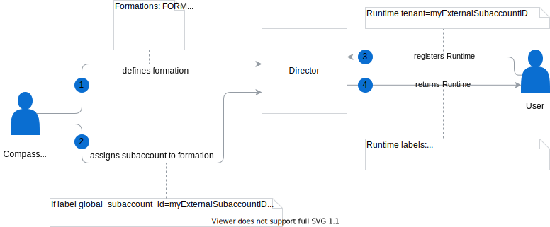

# Automatic Scenario Assignment

Automatic Scenario Assignment (ASA) feature allows defining condition when a Scenario is automatically assigned to the Runtime.
Condition is defined as a label selector.
For example, using this feature, you can specify a label that adds a given Scenario to each Runtime created by the given user, company or any other entity specified in the label.

## API

Automatic Scenario Assignment is defined in the following way:
```graphql
type AutomaticScenarioAssignment {
   scenarioName: String!
   selector: Label!
}

type Label {
   key: String!
   value: Any!
}

```
If a Runtime is labeled with a label that matches the value of the **selector** parameter, the Runtime is assigned to the given Scenario.

### Mutations
Director API contains the following mutations for managing Automatic Scenario Assignments:
```graphql
   createAutomaticScenarioAssignment(in: AutomaticScenarioAssignmentSetInput!): AutomaticScenarioAssignment 
   deleteAutomaticScenarioAssignmentForScenario(scenarioName: String!): AutomaticScenarioAssignment 
   deleteAutomaticScenarioAssignmentsForSelector(selector: LabelSelectorInput!): [AutomaticScenarioAssignment!]! 
}
```
When creating Assignment, the following conditions are checked:
* for given scenario, at most one Assignment exists
* given scenario has to exists
* selector's value type is a string

### Queries
Director API contains queries that allow you to fetch all assignments, fetch assignments for the given Scenario, and fetch assignments for the given label selector:
```graphql
   automaticScenarioAssignments(first: Int = 100, after: PageCursor): AutomaticScenarioAssignmentPage 
   automaticScenarioAssignmentForScenario(scenarioName: String!): AutomaticScenarioAssignment 
   automaticScenarioAssignmentsForSelector(selector: LabelSelectorInput!): [AutomaticScenarioAssignment!]! 
```

## Example
Let assume a situation, that Integration System that is responsible for registering Runtimes, label every runtime with information about a user who triggered provisioning a Runtime. 
Then, you can define an Assignment, that every Runtime provisioned by a given person belongs to the specific Scenario.

 

### Assign to the scenario when labeling Runtime

1. Create or update `scenarios` Label Definition and specify the following scenarios: 
* DEFAULT
* MARKETING
* WAREHOUSE

```graphql
mutation  {
  createLabelDefinition(in: {key: "scenarios", schema: "{\"items\":{\"enum\":[\"DEFAULT\",\"MARKETING\",\"WAREHOUSE\"],\"maxLength\":128,\"pattern\":\"^[A-Za-z0-9]([-_A-Za-z0-9\\\\s]*[A-Za-z0-9])$\",\"type\":\"string\"},\"minItems\":1,\"type\":\"array\",\"uniqueItems\":true}"}) {
    key
    schema
  }
}
```

2. Create an Assignment, that Runtimes created by a Warehouse administrator are assigned to the `WAREHOUSE` scenario.
```graphql
mutation  {
  createAutomaticScenarioAssignment(in: {scenarioName: "WAREHOUSE", selector: {key: "owner", value: "warehouse-admin@mycompany.com"}}) {
    scenarioName
    selector {
      key
      value
    }
  }
}
```
3. Register a Runtime, with a label that indicates that it was created by the Warehouse administrator.
```graphql
mutation  {
  registerRuntime(in:{name: "warehouse-runtime-1", labels:{owner:"warehouse-admin@mycompany.com"}}) {
    name
    labels
  }
}
```

As you can see from the output below, the Runtime is assigned to the `WAREHOUSE` scenario, thanks to the previously
defined Automatic Scenario Assignment. 
```json
{
  "data": {
    "registerRuntime": {
      "name": "warehouse-runtime-1",
      "labels": {
        "owner": "warehouse-admin@mycompany.com",
        "scenarios": [
          "WAREHOUSE"
        ]
      }
    }
  }
}
```

6. Remove Automatic Scenario Assignment.
```graphql
mutation  {
  deleteAutomaticScenarioAssignmentForScenario(scenarioName: "WAREHOUSE") {
    scenarioName
  }
}
```

7. Fetch information about previously created Runtime, for example by listing all Runtimes
```graphql
query  {
  runtimes {
    data {
      id
      name
      labels
    }
  }
}
```

As you can see, Runtime was unassigned from the `WAREHOUSE` scenario:
```json
{
  "data": {
    "runtimes": {
      "data": [
        {
          "id": "b5e1bf58-e8bb-4bde-a9c0-87650b0909c0",
          "name": "warehouse-runtime-1",
          "labels": {
            "owner": "warehouse-admin@mycompany.com"
          }
        }
      ]
    }
  }
}
```

The same situation occurs if you modify or remove the label `createdBy` for the Runtime.

### Assign to the Scenario when Automatic Scenario Assignment created
Assignment Runtime to scenarios occurs also when we define Assignment.
If there is a runtime, that matches aa coming Assignment, it will be automatically assigned to the Scenario.

1. Create runtime with label `owner`:`marketing-admin@mycompany.com`

```graphql
mutation  {
  registerRuntime(in:{name: "marketing-runtime-1", labels:{owner:"marketing-admin@mycompany.com"}}) {
    name
    labels
  }
}

```
2. Create an assignment:
```graphql
mutation  {
  createAutomaticScenarioAssignment(in: {scenarioName: "MARKETING", selector: {key: "owner", value: "marketing-admin@mycompany.com"}}) {
    scenarioName
    selector {
      key
      value
    }
  }
}
```

3. Check that the Runtime is assigned to the `MARKETING` scenario.
```graphql
query  {
  runtimes {
    data {
      id
      name
      labels
    }
  }
}
```

In the response you can find that given runtime is assigned to the `MARKETING` scenario.

```
{
  "data": {
    "runtimes": {
      "data": [
        {
          "id": "5b55bc5a-5a4d-443c-b519-7f5dcba2e6de",
          "name": "marketing-runtime-1",
          "labels": {
            "owner": "marketing-admin@mycompany.com",
            "scenarios": [
              "MARKETING"
            ]
          }
        }
        ...
      ]
    }
  }
}
```
