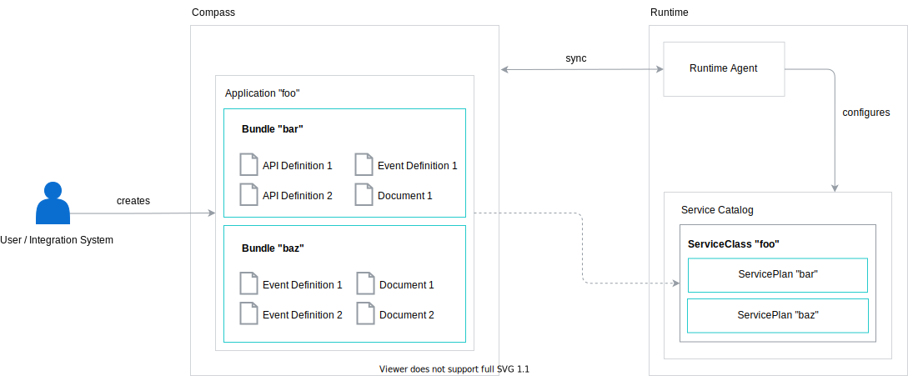

# API Bundles


Bundle is an entity that groups multiple API Definitions, Event Definitions, and Documents. It also stores shared credentials for all APIs defined under the particular Bundle.



In Kyma Runtime, every Application is represented as a single ServiceClass, and every Bundle of a given Application is represented as a single ServicePlan in the Service Catalog. It allows users to consume multiple APIs and Events with a single ServiceInstance.


A single Bundle can contain many different API Definitions/Event Definitions/Documents but the same API Definition/Event Definition/Document cannot belong to two different Bundles. One Bundles can belong only to one Application.


## GraphQL API

In order to manage Bundles, Director exposes the following GraphQL API:

```graphql
type Bundle {
  id: ID!
  name: String!
  description: String

  # (...) Auth-related fields described in the `Credentials Request for Bundles` document

  apiDefinitions(
    group: String
    first: Int = 100
    after: PageCursor
  ): APIDefinitionPage
  eventDefinitions(
    group: String
    first: Int = 100
    after: PageCursor
  ): EventDefinitionPage
  documents(first: Int = 100, after: PageCursor): DocumentPage
  apiDefinition(id: ID!): APIDefinition
  eventDefinition(id: ID!): EventDefinition
  document(id: ID!): Document
}

type BundlePage implements Pageable {
  data: [Bundle!]!
  pageInfo: PageInfo!
  totalCount: Int!
}

type Mutation {
  # (...)

  """
  Temporary name before doing a breaking change. Eventually, the `addAPIDefinition` mutation will be changed and there will be just one mutation: `addAPIDefinitionToBundle`.
  """
  addAPIDefinitionToBundle(
    bundleID: ID!
    in: APIDefinitionInput! @validate
  ): APIDefinition!
  """
  Temporary name before doing a breaking change. Eventually, the `addEventDefinition` mutation will be changed and there will be just one mutation: `addEventDefinitionToBundle`.
  """
  addEventDefinitionToBundle(
    bundleID: ID!
    in: EventDefinitionInput! @validate
  ): EventDefinition!
  """
  Temporary name before doing a breaking change. Eventually, the `addDocument` mutation will be changed and there will be just one mutation: `addDocumentToBundle`.
  """
  addDocumentToBundle(bundleID: ID!, in: DocumentInput! @validate): Document!
    @hasScopes(path: "graphql.mutation.addDocumentToBundle")

  addBundle(applicationID: ID!, in: BundleCreateInput! @validate): Bundle!
  updateBundle(id: ID!, in: BundleUpdateInput! @validate): Bundle!
  deleteBundle(id: ID!): Bundle!
}
```

## Bundle credentials

To learn about credentials flow for Bundles and how to provide optional input parameters when provisioning a ServiceInstance, read [this](./03-bundles-credential-requests.md) document.
