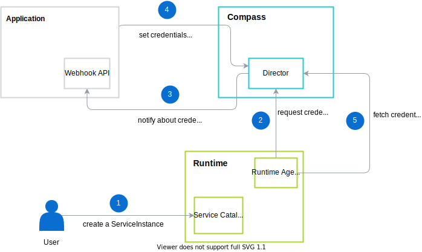

# Credential requests for Packages

## Introduction

On Runtime, Application is represented as Service Class, and every Package within Application is represented as Service Plan. This document describes credential requests for APIs during the Service Plan provisioning. It also mentions passing optional input parameters from Kyma Runtime to Application or Integration System during the provisioning process.

## Assumptions

- Multiple instances of a Package can be created in a single Runtime. For example, on Kyma Runtime, Package Instance is represented by Service Instance and it can be created for every namespace.
- Runtime requests credentials for API, while provisioning new Service Instance from a Package (Service Plan). During this step, additional input parameters can be passed. They are validated against input JSON schema provided by Application or Integration System. The parameters, as well the input JSON schema are completely optional.
- There is no trusted connection between Integration System and Runtime. In a result, the additional input parameters has to be passed to Application or Integration System via Compass Director.
- API credentials are defined on Package level. Multiple APIs under the same Package share the same credentials.

## Details

The Director GraphQL API is updated to store credentials per Service Instance. Credentials for every Instance across all Runtimes are stored on the Package level.

### API Credentials Flow

This diagram illustrates the API credentials flow in details. The Application provides Webhook API where Management Plane requests for providing new credentials for given Package.

> **NOTE:** There is an option that Application does not support Webhook API. That means Application needs to monitor registered API Definitions and set API credentials when new Runtime assigned. The Administrator can exchange credentials for registered APIs at any time too.



Assume we have Application which is already registered into Management Plane. No Runtimes are assigned yet. Application has one Package which contains single API Definition.

1. The Administrator requests new Runtime with Application via Cockpit.
2. The Cockpit requests configuration for Runtime and the Director asks Application for new credentials.
3. The Cockpit requests Runtime with configuration for Runtime Agent and Runtime Provisioner creates Runtime.
4. The Application sets Package credentials for the particular Service Instance of a given Runtime.
5. The Runtime Agent enables Runtime to call Application APIs.

### GraphQL Schema

```graphql
type Package {
  id: ID!
  # (...)

  """
  Optional JSON schema for validation user input while provisioning Service Class.
  """
  instanceAuthRequestInputSchema: JSONSchema
  instanceAuth(id: ID!): PackageInstanceAuth
  instanceAuths: [PackageInstanceAuth!]!
  """
  When defined, all requests via `requestPackageInstanceAuthCreation` mutation fallback to defaultInstanceAuth.
  """
  defaultInstanceAuth: Auth
}

type PackageInstanceAuth {
  id: ID!
  """
  Context of PackageInstanceAuth - such as Runtime ID, namespace, etc.
  """
  context: Any

  """
  User input
  """
  inputParams: Any
  
  """
  It may be empty if status is PENDING.
  Populated with `package.defaultInstanceAuth` value if `package.defaultAuth` is defined. If not, Compass notifies Application/Integration System about the Auth request.
  """
  auth: Auth
  status: PackageInstanceAuthStatus
}

type PackageInstanceAuthStatus {
  condition: PackageInstanceAuthStatusCondition!
  timestamp: Timestamp!
  message: String!
  """
  Possible reasons:
  - PendingNotification
  - NotificationSent
  - CredentialsProvided
  - CredentialsNotProvided
  - PendingDeletion
  """
  reason: String!
}

enum PackageInstanceAuthStatusCondition {
  """
  When creating, before Application sets the credentials
  """
  PENDING
  SUCCEEDED
  FAILED
  """
  When Runtime requests deletion and Application has to revoke the credentials
  """
  UNUSED
}

input PackageInstanceAuthRequestInput {
	"""
	Context of PackageInstanceAuth - such as Runtime ID, namespace, etc.
	"""
	context: Any
	"""
	JSON validated against package.instanceAuthRequestInputSchema
	"""
	inputParams: Any
}

type Mutation {
  """
  When PackageInstanceAuth is not in pending state, the operation returns error.

  When used without error, the status of pending auth is set to success.
  """
  setPackageInstanceAuth(packageID: ID!, authID: ID!, in: AuthInput! @validate): PackageInstanceAuth!
  deletePackageInstanceAuth(packageID: ID!, authID: ID!): PackageInstanceAuth!
  requestPackageInstanceAuthCreation(packageID: ID!, in: PackageInstanceAuthRequestInput!): PackageInstanceAuth!
  requestPackageInstanceAuthDeletion(packageID: ID!, authID: ID!): PackageInstanceAuth!
}
```

Application or Integration System can set optional `instanceAuthRequestInputSchema` field with a JSON schema with parameters needed during Service Class provisioning. The values provided by User are validated against the JSON schema.

### Example request credentials flow

1. User connects Application `foo` with single Package `bar` which contain few API and Event Definitions. The Package has `instanceAuthRequestInputSchema` defined.
1. User selects Service Class `foo` and Service Plan `bar`.
1. User provides required input (defined by `instanceAuthRequestInputSchema`) and provisions selected Service Plan.
1. Runtime Agent calls Director with `requestPackageInstanceAuth`, passing user input.
1. Director validates user input against `instanceAuthRequestInputSchema`. When the user input is valid, a new `PackageInstanceAuth` within Package `foo` is created.
   a. If `defaultInstanceAuth` for Package `foo` is defined, the newly created `PackageInstanceAuth` is filled with credentials from `defaultInstanceAuth` value. The status is set to `SUCCEEDED`.
   b. If `defaultInstanceAuth` for Package `foo` is not defined, the `PackageInstanceAuth` waits in `PENDING` state until Application does `setPackageInstanceAuth`. Then the status is set to `SUCCEEDED`.
1. After fetching valid credentials for Service Instance by Runtime, Service Instance is set to `READY` state.
