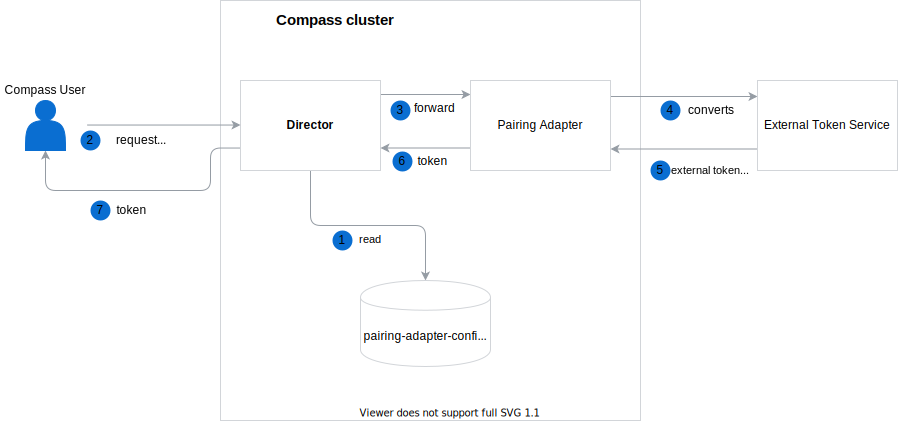

# Pairing Adapter 

If an Application is managed by the Integration System, a one-time token can be fetched not from the Connector
but from the External Service that allows for pairing Integration System and Application.
For that purpose, the Pairing Adapter component was created.
You can easily configure Pairing Adapter using environment variables. It allows for translating requests from the Director to any external system.  
If the Integration System defines a Pairing Adapter, the Director passes all information regarding a given Application to the Adapter to generate a token.
To configure a Pairing Adapter for the Integration System, edit the `pairing-adapter-config` ConfigMap.
The ConfigMap has the following structure:

```
config.json: '{"{integration system id}":"{pairing adapter URL}"}'
```

See the example:

```
config.json: '{"0c4bfacf-2237-40f1-ab3d-8e35582e26f2":"http://compass-pairing-adapter/adapter"}'
```

Communication between the Director, Pairing Adapter and External Token Service is presented in the following diagram:



1. Director reads configuration of the available Pairing Adapters at the startup time.
2. A user requests a one-time token for an Application that has defined Integration System with a registered Pairing Adapter.
3. Director forwards the request to the given Pairing Adapter.
4. Adapter translates the request from the Director to the format compatible with the External Token Service.
5. External Token Service returns a token.
6. Pairing Adapter translates a response from the External Token Service to the format compatible with the Director.
7. Director returns the token to the User.
