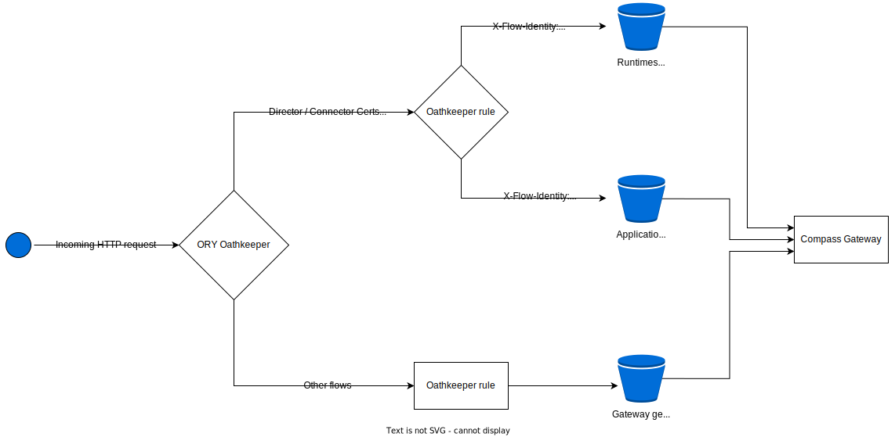

# CMP Rate Limiting

Rate-limiting is implemented in CMP using the [Istio's local rate-limiting](https://istio.io/latest/docs/tasks/policy-enforcement/rate-limit/#local-rate-limit) functionality, which enables rate-limiting at instance level. In terms of Kubernetes, it can be considered as rate-limiting per Pod. Enablement is done by applying an [EnvoyFilter](https://istio.io/latest/docs/reference/config/networking/envoy-filter/), which is responsible for maintaining **token-buckets**. A token-bucket is a simple data structure, which contains a fixed amount of tokens. For each HTTP request that arrives, a token is removed from the token-bucket. When the token-bucket gets empty, the next incoming request gets rate-limited. This results in an early termination of the request handling and an HTTP status-code of 429 (Too Many Requests) is returned. Then, the token bucket is refilled on regular intervals with a fixed amount of tokens. The initial token count, refill rate, and the amount of tokens per refill can be configured in the EnvoyFilter's resource description.

## EnvoyFilters in CMP 

The following rate-limiting *EnvoyFilter* resources are created in CMP:

- *EnvoyFilter* for **Compass Gateway**
- *EnvoyFilter* for **Compass ORD-Service**

Since most of the CMP authentication flows pass through the Gateway component (the upstream for most of the [ORY rules](../../chart/compass/charts/gateway/templates/oathkeeper-rules.yaml) is the gateway service) it is an appropriate service to apply rate-limiting to capture most of the incoming requests to CMP. Several flows end up in the ord-service and for this reason the second *EnvoyFilter* is applied there. The rest of the flows are either for internal calls (no rate-limiting needed) or for the system-broker component, for which the CMP does not apply rate-limiting.
 
### Gateway EnvoyFilter

The [Gateway EnvoyFilter](../../chart/compass/charts/gateway/templates/rate-limit-filter.yaml) leverages [descriptors](https://www.envoyproxy.io/docs/envoy/latest/configuration/http/http_filters/local_rate_limit_filter#using-rate-limit-descriptors-for-local-rate-limiting) and thus describes 3 token buckets. A *descriptor* is a key-value pair, which provides information about the current request. *Descriptors* are created by *actions*. 

The gateway EnvoyFilter has 1 action, which creates a descriptor with a key `consumer`. The value of the descriptor for each HTTP request is retrieved from an HTTP header, which is `X-Flow-Identity` in the default configuration. This header is added in the **compass-director-certs** and **compass-connector-certs** auth flows (described by the [ORY rules](../../chart/compass/charts/gateway/templates/oathkeeper-rules.yaml) with the same names) by an ORY Header Hydrator, which inspects the ORY session to get the value for it. The value of the header is the type of the consumer (*Application*, *Runtime*, or *Integration System*). Thus, the `consumer` descriptor's value can be one of these 3 possible consumer types. 

In case the value of the descriptor is *Runtime* or *Application* the request is matched by the EnvoyFilter and a separate token-bucket is used to determine whether to rate-limit the request or not. Alternatively, the *general* token-bucket is used. Note that all other authentication flows (except the **compass-director-certs** and **compass-connector-certs**) match [ORY rules](../../chart/compass/charts/gateway/templates/oathkeeper-rules.yaml), which don't add the `X-Flow-Identity` header. Respectively, the `consumer` descriptor is not created for them and as a result they also end up in the *general* token-bucket. The following diagram outlines the flow:

The header that is used to fill the value with the descriptor is configurable from the values of the compass Helm chart.

### ORD-Service EnvoyFilter

The flows, which end up in the **Compass ORD-Service** without passing through the **Compass Gateway** are processed by the [ORD-Service EnvoyFilter](../../chart/compass/charts/ord-service/templates/rate-limit-filter.yaml). This EnvoyFilter uses a simpler version of the token-bucket method described for the Gateway. In this scenario there is **only one** token-bucket and the rate-limiting for all incoming HTTP requests is determined by it. 
