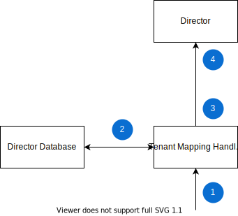

# Tenancy
Tenant is a single object that owns resources.
Every tenant's resources are isolated from the other tenants, which ensures data security and privacy.
Compass Director is a multi-tenant service, which means that a single instance of Director is shared among different tenants (clients), but their data is isolated.

## Tenancy in Director
Director manages the configuration of the following main objects:
* [Application](https://github.com/kyma-incubator/compass/blob/main/docs/compass/02-01-components.md#application)
* [Runtime](https://github.com/kyma-incubator/compass/blob/main/docs/compass/02-01-components.md#kyma-runtime)
* [LabelDefinition](https://github.com/kyma-incubator/compass/blob/main/docs/compass/03-02-labels.md#labeldefinitions)
* [Automatic Scenario Assigment](https://github.com/kyma-incubator/compass/blob/main/docs/compass/03-03-automatic-scenario-assignment.md)
* [Integration System](https://github.com/kyma-incubator/compass/blob/main/docs/compass/02-01-components.md#integration-system)
* [ApplicationTemplate](https://github.com/kyma-incubator/compass/blob/main/docs/compass/02-01-components.md#applicationtemplate)

Applications, Runtimes, LabelDefinitions, and Automatic Scenario Assignments and their child resources, such as APIs, are bound to tenants.
Integration Systems and ApplicationTemplates are not bound to any tenant and can represent multiple tenants.

Tenancy in Director is implemented on the level of a database in which a given tenant has its own entity.
Every object which belongs to a tenant has the `tenant_id` column which points to the actual tenant entity.
A tenant is mainly described by two properties: 
* Global tenant identifier - can be any string, treated like an identifier from an external system 
* Internal tenant identifier - used as an internal technical identifier (UUID) to which `tenant_id` columns refer to. It allows for unified tenant identification in Director. Thanks to this approach, external systems can describe their tenants in their own way without any impact on the Director internals.

Those properties are stored together with the metadata in the `business_tenant_mapping` table in the database.

The Compass Director GraphQL API exposes [tenants query](https://github.com/kyma-incubator/compass/blob/main/components/director/examples/query-tenants/query-tenants.graphql). 
The query returns a list of all tenants with their external identifier, internal identifier, and additional metadata. 
## Creating tenants
You can create a tenant in Director manually by using the [SQL statement](https://github.com/kyma-incubator/compass/blob/main/components/schema-migrator/seeds/director/add_tenants.sql) or use one of the following importing mechanisms:
* [Tenant Loader](https://github.com/kyma-incubator/compass/tree/main/components/director/cmd/tenantloader) - a one-time job for importing tenants from files during the first Compass installation
* [Tenant Fetcher](https://github.com/kyma-incubator/compass/tree/main/components/director/cmd/tenantfetcher) - a periodic job that synchronizes tenants from an external system
* [Tenant Fetcher Deployment](https://github.com/kyma-incubator/compass/tree/main/components/director/cmd/tenantfetcher-svc) - a deployment which can be notified when a tenant is created, or when one tenant gained access to resources in another tenant without a parent-child relationship between them (also called as consumer-provider flow, you can read more about it in the [Compass security documentation](../compass/03-01-security.md))

## Authentication flow
Information about tenants is used during the authentication and authorization phase in Compass.
Every incoming request is routed to the component called Hydrator that has an Oathkeeper hydrator mutator called Tenant Mapping Handler. The request is processed by it and then rerouted to the Director component through the auditlog Gateway.

The tenant mapping flow is as follows:
1. The incoming request is intercepted by Istio and Oauthkeeper and then sent to the Hydrator component and Tenant Mapping Handler.
2. Tenant Mapping Handler looks for an external tenant identifier in request headers and request body under the **headers** and **extra** keys.
3. Tenant Mapping Handler maps an external tenant to the internal tenant using `business_tenant_mapping` and `system_auth` tables from the Director database.
4. Tenant Mapping Handler passes additional data (such as, the internal tenant identifier and caller identity) back to Oauthkeeper. Oauthkeeper mutators put the data into JWT, which is sent to Director through auditlog Gateway component.
5. Director validates the token and extracts the internal tenant identifier.

Having this information, Director can work as a multi-tenant service. For more information, refer to the document about [security in Compass](https://github.com/kyma-incubator/compass/blob/main/docs/compass/03-01-security.md).
