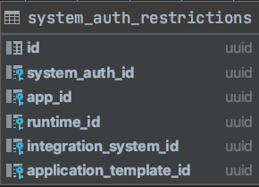

# Limiting Access to GraphQL Resources 

This document describes a possible solution to the problem of unlimited resource access. The problem that needs to be corrected is the current possibility of one application in tenant X to modify the metadata of another application in the same tenant X. This problem is also valid for runtimes. Furthermore, integration systems have global access to all data in Compass. An optimal solution features an integration system that is limited to access only its own resources (newly created in the system) or resources, to which the system has granted access already.

The solution proposal includes limiting the access to operations for `applications`, `application_templates`, `runtimes`, and `integration systems`.

## Terminology

* API Consumer - An API Consumer could be any of the following: application, runtime, integration system, or user.
* Owner (or owning entity) - A top-level entity to which a given resource belongs. For example, an application is the owner of packages, api definitions, documents, and so on. In this context, the following owner types are available: `application`, `runtime`, `integration system`, and `application template`.

## Requirements

When a user makes a query or mutation, the secured resolvers concept should not limit the user's access. Put simply, the user consumer type should not be affected by the secured resolvers concept.

By default, an application must not be allowed to modify another application's metadata within the same tenant. This applies not only for the top-level application entity but also for all its related sub-entities such as: packages, API and event definitions, documents, and so on. For example, application X must not be allowed to insert API definitions in package Y when package Y belongs to application Z, even if both applications X and Z are in the same tenant.

By default, a runtime must not be allowed to modify another runtime's metadata within the same tenant. Additionally, a runtime must not be allowed to fetch applications that belong to other runtimes.

By default, an integration system must not be allowed to modify another integration system's metadata.

In general, integration systems can manage other systems and their metadata (such as applications, and runtimes). However, an integration system must be allowed to modify only entities that it has created, or entities to which it has granted access for modifications. For example, if an integration system registers an application, later on, it can  also register packages for this application. However, it cannot modify metadata for applications that other consumers registered, unless it has granted access explicitly to do so. Another example is when a user registers an application via the UI. To get access to this application, the integration system X either must be granted this access by the user via an API call to Director (grant access to the integration system for this application), or some automated procedures must be in place (a concept about stacking credentials via one time tokens is available in the further sections of this document). Although the given examples are related to applications, these requirements are also valid for application sub-entities, application templates, and runtimes managed by integration systems.

Some integration systems (such as UI applications) require unrestricted access to the Director API. They should keep working properly having a global view/access.

An implicit requirement, derived from the requirements above, is that no system must be allowed to list all applications, runtimes, or integration systems.

Out-of-scope: Limit access to the `auths` field of each type to admin users only.

## Current State

The following section analyzes the problem in all current queries and mutations, and groups them in sections providing a conceptual solution.

The problem with securing resolvers is three dimensional. It features all three: mutations/queries; consumer, and owner. In total, there are about 40 mutations/queries that have to be secured, 4 consumer types, and 4 owner types. For specific queries/mutations there is always a single owner but obtaining the id of that owner is not always straight forward. For example, in getApplication(applicationID) the owner id is passed as input to the query, however, in updatePackage(packageID) some special code needs to be executed to find the application id from the package id. In the case of updateAPIDefinition(apiDefID) the special code that needs to be executed to derive (nck: To derive what?).

Why it is important who is the owner and what is the owner ID?

Currently, with the help of the ORY integration, the Director API always recieves an ID token, regardless of the actual authentication mechanism. Then, the details about the actual caller/consumer can be extracted from the ID token, and then, stored in the Go context. Therefore, on a very high level, it is needed to ensure that the consumer from the Go context matches to the owner of the requested resource. More broadly put (and required especially for integration systems), it is important to verify that the consumer can access the owner's resources. For example, if the owner is an application, the resources that must be accessible are the application details, packages, and so on.

### Determining the owner ID

Having the owner id helps for the cases where the consumer and owner types match. For example, if app X is updating an api definition, calculating the owner id of the api definition (the app this api definition belongs to) and comparing it to the consumer id would let us know whether this request should be allowed to proceed or not. More complex cases in which consumer and owner types differ require slightly different solutions.

Determining the owner id during queries and mutations was thoroughly researched by analysing each query and mutation. Only the results of this research are provided here and grouped in sections by the type of the owner:

#### Owner Application

The queries and mutations whose owner is an application can be grouped in 8 categories depending on the input provided to the query or mutation. In each category a different piece of source code must be executed in order to determine the owner id.

1. Queries and mutations that provide the owner id as part of the client input (examples: `getApplication`, `updateApplication`, `addPackage`, etc). For these, the owner id can be picked up from the graphql arguments list.
2. Queries and mutations that provide a `packageID` as part of the client input (examples: `updatePackage`, `deletePackage`, `addDocumentToPackage`, etc). For these, the owner id can be determined by fetching the actual package with id qual to the `packageID` from the graphql arguments list and getting its `applicationID`.
3. Queries and mutations that provide the `documentID` as part of the client input (examples: `updateDocument`, `deleteDocument`). For these we need to fetch the document with id equal to the `documentID` from the graphql arguments list, get its `packageID`, fetch the package and get its `applicationID` which would be the owner ID.
4. Queries and mutations that provide `APIDefinitionID` as part of the client input (examples: `updateAPIDefinition`, `deleteAPIDefinition`). Fetch the api definition with id equal to the `APIDefinitionID` from the graphql arguments, get its `packageID`, fetch the package and get its `applicationID` which would be the owner ID.
5. Queries and mutations that provide `EventDefinitionID` as part of the client input (examples: `updateEventDefinition`, `deleteEventDefinition`). Fetch the event definition with id equal to the `EventDefinitionID` from the graphql arguments, get its `packageID`, fetch the package and get its `applicationID` which would be the owner ID.
6. Queries and mutations that provide `webhookID` as part of the client input (examples: `updateWebhook`, `deleteWebhook`). Fetch the webhook with id equal to the `webhookID` from the graphql arguments and get its `applicationID` which would be the owner ID.
7. Queries and mutations that provide `systemAuthID` as part of the client input (examples: `deleteSystemAuthForApplication`). Fetch the system auth (or a record from a different table that contains both `applicationID` and `system_auth_id` and take the `application_id` as owner id).
8. Queries and mutations that provide `packageInstanceAuthID` as part of the client input (examples: `setPackageInstanceAuth`, `deletePackageInstanceAuth`). Fetch package by `packageInstanceAuthID` taken from graphql arguments and get the package `applicationID` as owner id.

#### Owner Runtime

1. Queries and mutations that provide the owner id as part of the client input (examples: `getRuntime`, `updateRuntime`, `deleteRuntime` etc). For these, the owner id can be picked up from the graphql arguments list.
2. Cases in which the owner is of different type (e.g. `applicationsForRuntime`). For these the `runtimeID` is again provided as input and it can be used as ownerID to be compared against the consumerID in case the consumer is of type Runtime. However, additional checks based on scenarios are also performed baked in the resolver code.

Runtimes consuming APIs owned by different types (e.g. `query application`, `requestPackageInstanceAuthCreation` is discussed at a later section.

#### Owner Integration System

1. Queries and mutations that provide the owner id as part of the client input (examples: `getIntegrationSystem`, `updateIntegrationSystem`, `deleteIntegrationSystem` etc). For these, the owner id can be picked up from the graphql arguments list.

Integration systems consuming APIs owned by different types is discussed at a later section.

#### Owner Application Template

When talking about application templates, whichever system creates them, should be able to modify them and no one else (apart from Users) should be to do so by default.

This "owner" type is a bit different from the others as there is no consumer of this type. So this means that obtaining the `owner_id` wouldn't really help us scope the access. If let's say integration system X created template Y, we would need some sort of a relation such as `integration_system_id` column in the `app_templates` table. This is actually the case with consumer=integration system for all owner types and the fact that `owner_id` is not sufficient will be further detailed out in the next section.

#### Owner sum-up

It's pretty questionable why it was decided to pass the ownerID in all sections 1 of the previous paragraphs. The issue is that when the owner and the consumer match and the consumed api is directly identified by the owner id (for exampple getApplication(appID) called by the actual application), it's sufficient for the caller to just provide its authentication details from which the consumer id is extracted. Asking the caller to provide the owner id as graphql argument adds additional complications to the API logic (the API has to verify that the consumer provided an owner id that matches his consumer id) which is redundant and unncessesary. However, we decided not to change the APIs as part of this design so such a "redundant" check will exist, hopefully it will be generalized as part of a more generic solution.

If we extend the storage layer with custom queries we can make sure that calculation of the ownerID always requires atmost 1 db query to be executed. If we use the currently provided queries, there are situations in which calculation of ownerID would require 2 or 3 queries (for example `updateAPIDefinition` would require to fetch the api def and fetch the package. In case the consumer is integration system, we might need to even fetch the whole application entity which would be a 3rd query)

A different approach at determining the owner ID would be to store it in each table (so each table that is directly or trasitively related applications must store application_id). However, this complicates the database schema. Also the logic for calculating the owner ID would still be needed but it will be implmeneted during creation or resources, so we don't really make the implementation simpler by duplicating the owner id column everywhere.

This section analysed the APIs from the owner perspective. Basically, when the consumer and owner types match, we can calculate the `ownerID` and compare it to the `consumerID`. If they match, the request is allowed to proceed. Things get more complex with different consumer types.

### Analysing different consumer types

Everything would have been pretty simple if consumers and owners types always matched. However, this is not the case (for example runtimes can consume apis where the owner type is application and integration systems can consume apis whete the owner type can be any)

Having the owner ID would help us solve the simplest cases such as allowing only application X to update its metadata or allowing only application X to update its packages or allowing runtime R to fetch to be the only runtime allowed to fetch its applications or allowing only integration system I to update its own metadata. However, there are more complications when the consumer is of type Integration System. The following section provides a quick analysis of the diffrent consumer type cases (the consumer details are provided in the Go context)

#### Consumer Type User

No additional restrictions should be applied.

#### Consumer Type Application

There is no actual usecase for an application to consume APIs owned by other owner types. So the analysis from the Owners section is sufficient.

#### Consumer Type Runtime

There are a few queries and mutations owned by owner type application that runtimes consume.

* `query application`, `mutation requestPackageInstanceAuthCreation`, `mutation requestPackageInstanceAuthDeletion` - there should be a scenario check baked in the resolver implementation. It seems such scenario check is currently missing. Instead of implementing a scenario check is all these places we might try to fit these in the generic design of secured resolvers.
* `query applicationsForRuntime` already performs a scenario check baked into the code. However, as already mentioned in the document, this query also accepts a `runtime_id` as input parameter and an "ownerID equals consumerID" check must be added.

#### Consumer Type Integration System

When consumer type is integration system and owner type is application, runtime or application template, the `ownerID` check described above does not help. We need to develop some association between these entities and the integration system. Instead of calculating the ownerID, we would need to get the owner entity and get its integration system id, then compare it with the `consumerID`.

## Solution Proposal

The purpose of the proposal is to provide a single solution that solves all of the above cases in a generic fashion. Instead of trying to model the idea which consumer (application, int system, runtime) can access what owning entity (app, app template, runtime, int system) and its subentities, we are going to try to abstract the consumer dimension away by using something all technical consumers have in common - system auths. So instead of trying to figure out what is the consumer type and based on that decide what to compare its comsumer id to, we will check what accesses were granted to the system auth related to this consumer. This abstraction of `system auth accesses` removes the necessity to care what the consumer type is and access checks would be performed against the `system_auth_id` of the consumer instead of the `consumer_id`. Basically, when a request comes we can simply check if the consumer system represented by the `system_auth_id` from the id token was granted access to owner entity. The owner entity id needs to be calculated as described previously in the document. There are several different inputs for granting access to consumer for an owner entity, most of which are automated as part of other flows. `System auth accesses` will be stored in a new table. Each row contains information about a `system_auth_id` and the relevant `application_id`, `runtime_id`, `integration_system_id` or `application_template_id` to which this `system_auth_id` has access.

### Add additional details in ID token

The ID token created via data provided by the tenant mapping handler currently contains details about `consumer_type` and `consumer_id`. We will extend it to also include details about `consumer_level` and `system_auth_id`. `consumer_level` represents the level of access the consumer has (`RESTRICTED` or `UNRESTRICTED`) and `system_auth_id` is the id of the system auth that the consumer is authenticating with.

Tenant Mapping Handler grants `UNRESRICTED` consumer level access to Users and to special or legacy integration systems such as UIs that require global access. In order to model such systems, an additional column should be added to the `system_auths` table with values `RESTRICTED`, `UNRESTRICTED`.

### System auth access

System auth access (or system auth restrictions) represents what permissons were granted to a specific set of system credentials. For example if integration system X uses client credentials represented by system_auth_id=123, a record in `system_auth_acccess` with system_auth_id=123 and app_id=456 means that the consumer (integration system) can access and modify metadata and subentities of application with id=456.



### limitAccess directive

It would be better if checks about who can access what are done in a central place, preferably before the actual resolver business logic of the query or mutation. Since relevant data about access permissions is stored in one table, we can design a directive that can perform the checks.

```graphql
directive @limitAccess(ownerProvider: String!, idField: String!) on FIELD_DEFINITION
```

* `ownerProvider` is a key that describes how the ownerID of the owner entity can be obtained
* `idField` is the name of the graphql query or mutation argument that will be used in order to calculate the ownerID.
* the directive struct holds a map of provider functions with keys `ownerProvider` values. These functions know how to calculate the owner id for the respective query or mutation on which the directive is specified.

#### Flow

The proposed directive does following things:

1. load consumer info from context - consumer info contains `consumer_level` and `system_auth_id`
2. check if `consumer_level` is `UNRESTRICTED` and if so, allow access
3. Get the graphql argument represented by the value of `idField`
4. Look into the map of owner providers and find the owner provider function represented by the `ownerProvider` key specified in the directive
5. Execute the provider function by passing the argument obtained from the `idField` and get the owner entity details.
6. After obtaining the ownerProvider ID from 5., check if a record in `system_auth_access` exists for this owner id and the `system_auth_id` that is part of the consumer info.
7. if yes, the request is allowed.
8. if no, the request is stopped.

#### Extending the database layer

We can merge steps 5 and 6 if we bake the `system_auth_access` check into the provider function by joining the `system_auth_access` table to the underlying database query executed by the provider function. For this, we will need some custom database queries.

#### Examples

```graphql
type Query {
    application(id: ID!): Application @hasScopes(path: "graphql.query.application") @limitAccess(ownerProvider: "GetApplicationID", idField: "id")
}
```

* `idField` value is "id" because this is the name of the graphql argument
* in the directive source could `ownerProvider` "GetApplicationID" matches to a function that executes a DB query which calculates the `owner_id` (in this case it's pretty simple as the id is part of the input) and checks whether the relevant system_auth_access exists.

The actual provider function that the directive executes looks like this:

```go
providers: map[string]func(ctx context.Context, tenantID string, id string, authID string) (bool, error){
			"GetApplicationID": func(ctx context.Context, tenantID string, id string, authID string) (bool, error) {
				consumerInfo, err := LoadFromContext(ctx)
				if err != nil {
					return false, errors.New("error missing consumer info")
				}

				// performance optimization, db call below would work too
				if consumerInfo.ConsumerType == Application {
					return consumerInfo.ConsumerID == id, nil
				}

				return appRepo.ExistsApplicationByIDAndAuthID(ctx, tenantID, id, authID)
            },
  // Other providers go here
}
```

```go
func (r *pgRepository) ExistsApplicationByIDAndAuthID(ctx context.Context, tenantID, id, authID string) (bool, error) {
	stmt := fmt.Sprintf(`SELECT 1
FROM %s AS a 
JOIN %s AS s on s.%s=a.id 
WHERE a.tenant_id=$1 AND a.id=$2 AND s.%s=$3`,
		applicationTable,
		systemAuthRestrictionsTable,
		applicationRefField,
		systemAuthRefField)

	return r.exists(ctx, stmt, tenantID, id, authID)
}
```

A more complex example:

```graphql
updateEventDefinition(id: ID!, in: EventDefinitionInput! @validate): EventDefinition! @hasScopes(path: "graphql.mutation.updateEventDefinition") @limitAccess(ownerProvider: "GetApplicationIDByEventDefinitionID", idField: "id")
```
* `idField` matches the name of the graphql argument for the event definition id
* the `GetApplicationIDByEventDefinitionID` key matches a function that executes the following database query:

```go
func (r *pgRepository) ExistsApplicationByEventDefinitionIDAndAuthID(ctx context.Context, tenantID, id, authID string) (bool, error) {
	stmt := fmt.Sprintf(`SELECT 1 
FROM %s AS a 
JOIN %s AS p on a.id=p.%s 
JOIN %s AS d on p.id=d.%s
JOIN %s AS s on s.%s=a.id
WHERE a.tenant_id=$1 AND d.id=$2 AND s.%s=$3`,
		applicationTable,
		packageTable,
		applicationRefField,
		eventDefinitionsTable,
		packageRefField,
		systemAuthRestrictionsTable,
		applicationRefField,
		systemAuthRefField)

	return r.exists(ctx, stmt, tenantID, id, authID)
}
```

Notice how the query calculates the owner id (application id) and does the necessary `system_auth_access` check at the same time, returning simply a bool whether access was granted or not.

The actual provider function is pretty simple as no external performance optimizations are needed:

```go
"GetApplicationIDByAPIDefinitionID": appRepo.ExistsApplicationByAPIDefinitionIDAndAuthID,
```

Finally, a reference implementation for the directive logic can look like this:

```go
func (d *limitAccessDirective) LimitAccess(ctx context.Context, _ interface{}, next graphql.Resolver, key, idField string) (interface{}, error) {
	ctx = persistence.SaveToContext(ctx, d.db)

	consumerInfo, err := LoadFromContext(ctx)
	if err != nil {
		return nil, errors.New("error missing consumer info")
	}

	if consumerInfo.ConsumerLevel == Unrestricted {
		return next(ctx)
	}

	if consumerInfo.SystemAuthID == "" {
		return nil, errors.Errorf("system auth id not found in consumer context for consumer type %s", consumerInfo.ConsumerType)
	}

	fieldContext := graphql.GetFieldContext(ctx)
	inputID := fieldContext.Args[idField].(string)

	tenantID, err := tenant.LoadFromContext(ctx)
	if err != nil {
		return nil, errors.Wrapf(err, "while loading tenant from context")
	}

	providerFunc, found := d.providers[key]
	if !found {
		return nil, fmt.Errorf("owner provider not found for key %s", key)
	}

	exists, err := providerFunc(ctx, tenantID, inputID, consumerInfo.SystemAuthID)
	if err != nil {
		return nil, errors.Wrapf(err, "could not provide owning entity")
	}

	if !exists {
		return nil, apperrors.NewInvalidOperationError(fmt.Sprintf("consumer of type %s with id %s is not allowed to access the requested resource",
			consumerInfo.ConsumerType, consumerInfo.ConsumerID))
	}

	return next(ctx)
}
```

### Inputs for creating system auth access

It's important to mention when the actual records in `system_auth_restrictions` are created. There are several existing flows that are extended to automatically insert `system_auth_restrictions`.

1. During creation of applications, runtimes, integration systems and application templates, when the consumer type is NOT User, a record has to be inserted so that the consumer system can later access what it created created.
2. During issuing system credentials for applications, runtimes and integration systems a record has to be inserted so that relevant system can later on access its own metadata.
3. (Out-of-scope) It is possible to also model scenario labeling as another input for `system_auth_access` creation. This would allow us to not have to bake scenario checks in some specific directives but rather use the system access check that is part of the `limitAccess` directive  

Also, two new GraphQL mutations are introduced to allow admin users to grant and revoke access for systems. The new mutations are protected with a new scope `system_access:write` that is given to admin users.

```graphql
input SystemAuthAccessInput {
	to: SystemAuthAccessToInput!
	for: SystemAuthAccessForInput!
}

input SystemAuthAccessForInput {
	applicationID: String
	applicationTemplateID: String
	runtimeID: String
	integrationSystemID: String
}

input SystemAuthAccessToInput {
	applicationID: String
	runtimeID: String
	integrationSystemID: String
}

type SystemAuthAccessFor {
	applicationID: String
	applicationTemplateID: String
	runtimeID: String
	integrationSystemID: String
}

type SystemAuthAccessTo {
	applicationID: String
	runtimeID: String
	integrationSystemID: String
}

type SystemAuthAccess {
	to: SystemAuthAccessTo!
	for: SystemAuthAccessFor!
}

grantSystemAccess(in: SystemAuthAccessInput! @validate): SystemAuthAccess @hasScopes(path: "graphql.mutation.grantSystemAccess")

revokeSystemAccess(in: SystemAuthAccessInput! @validate): SystemAuthAccess @hasScopes(path: "graphql.mutation.revokeSystemAccess")
```

A relevant usecase for the API would be having a User register an application and then the User can grant access to an integration system to further manage the application details.

### Additional list scope

We will introduce some new scopes so that systems can't list all applications, runtimes or integration systems. These scopes we will be assigned to Users only.

* integration_system:list - for admin user
* runtime:list - for admin user
* application:list - for admin user

A possible improvement would be to grant list access to systems too but filter the response based on `system_auth_access` so that a system can list only what it is authorized to see.

### Benefits

1. There are foreign key constraints for everything related to the `system_auth_access` table and no custom exists checks are needed, also cascade deletions can be leveraged and no custom implementation in deletion flows in needed.  
2. Logic in grant access api is relatively simple.
3. Amount of data in `system_auth_access` is relatively small. 

### Drawbacks

1. Since we abstract away the consumer dimension by using its system_auth/credentials, when a consumer gets a second set of credentials, these second credentials won't be authorized to access what the first set can access by default. Granting the second set of credentials the same accesses as the first set has would require copying the records from `system_auth_access` relevant for the first `system_auth_id` also for the second `system_auth_id`. This can also be mitigated by allowing a single set of credentials per system (which seems naturally the correct thing to do). It can also be considered a security improvement in the sense that if someone manages to request a second set of credentials for an existing system, he/she won't be able to tamper with the data that this system can actually access.
2. While we managed to achieve a design with a single directive, its logic still has a certain degree of complexity in it due to the concept of provider functions and the required provider key input parameter. 

## Variations to the `system_auth_acesss` table

### Modeling consumer to resource access 

One possible variation would be to rename the table to `resource_access` and store `consumer_id`, `consumer_type`, `resource_id`, `resource_type` where the first two columns specify who the consumer (app, int system, runtime) that can access the resource is. The `resource_id` and `resource_type` columns specify which is the actual resource that can be accessed (it can be in any other table in the database).

Since in this approach we store information about who can access every single resource, we could model "access filters" that will be added in the Go context and used to extend the select database query with a join and a where clause. This way we won't need to do db calls in the directive, the directive will just add access filters to the go context.

#### Benefits:

1. The directive logic becomes simpler. It doesn't need a map of providers but can just execute a common query for all cases:
```sql
SELECT 1 
FROM resource_access 
WHERE consumer_id='consumer-id-from-ctx' 
    AND consumer_type='consumer-type-from-ctx' 
    AND resource_id='input-from-graphql-args'
```

2. Also, we solve the concern from the above approach where creating a second set of credentials for a system won't have the same access rights will not require additional implementation as we are going away from system_auths. 

#### Drawbacks 

1. The table will be very big - it will contain as much rows as the sum of all rows of all other tables multiplied by the number of consumers.
2. Inserting in the table will need to happen in each create, register, add resolver. In some resolvers such as RegisterApplication that create additional related resources as part of the resolver logic (`createRelatedResources` method) there would also need to be inserts to the `consumer_access` table. Basically, we would need to modify each Repository.Create method to also insert in the `consumer_access` table.
3. The new API `grant_consumer_access` would be pretty tough to implement as if we are granting access to integration system for application and all its subentities, we would need custom logic to verify the app exists and find all subentities ids so we can insert relevant records to `consumer_access` with `resource_id` values. This custom logic will be different for runtimes and integration systems and it looks like this API will become pretty complex.
4. Due to the fact the that id columns can represent multiple different entities, there cannot be foreign key constraints to verify that the consumer and resource actually exist and to allow cascade deletion when the consumer or resource are deleted. This means that we would need custom logic during deletion of a resource to find and delete all its `related` records in the `consumer_access` table. Basically, each Repo.Delete method would need to also check and delete relevant related `consumer_access` records. 
5. How do we model UNRESTRICTED access for global integration systems such as UI, KEB and provisioner ? 

### Modeling consumer to owner access

Having access data stored for every single resource seems a bit execessive. In this approach we limit the stored access information to the owners only.

Here, the two models from the previous sections meet in the middle - the table would be a `consumer_access` with columns `consumer_id`, `consumer_type`, `owner_id`, `owner_type`.

#### Benefits

1. This approach still solves the multiple credentials for a system drawback of the first approach 
2. The actual table will contain less rows than the previous two approaches. 
3. The grant access API would be much simpler to implement than in the second approach but still a bit more complex than in the first approach as we need to check if the consumer and owner exist (due to lack of FK constraints)

#### Drawbacks

1. It still has a more complex directive with provider functions similarly to the first approach
2. Foreign keys are still not possible similary to the second approach so custom exists validation in grant access API and custom delete logic during deletion of an owner resource is needed. In this case we don't need to modifiy the deletion of all resources but only for the 4 owner types.
3. How do we model UNRESTRICTED access for global integration systems such as UI, KEB and provisioner ? Maybe empty owner ? - this is not very idiomatic. 


## Additional Researched Approaches

Only listing the additional approaches that were PoCed. If any of them peak interest, we can further discuss.

* helper functions, custom implementaion in each resolver
* copy owner_id and integration_system_id to each table so that owner id does not need to be calculated in each mutation and use a field criteria approach in which the actual business logic query will have a specific enough where clause so that it can decide whether access is granted or not. Basically a field filter/criteria will be appended by some middleware and this field criteria will specify values for owner_id and integration_system_id. This filter/criteria is eventually included as part of the where clause of the db query.
* generic middleware that swithces over all mutations and queries and executes the relevant custom logic
* require owner id in each mutation ontop of whatever input is already required so that owner id does not need to be calculated on each mutation
* add an ownerReference resolver (returns details about owning entity) on each input. Via a special GraphQL field interceptor/middleware add an artifical field to the input so that resolver is called. In the same or another middleware add logic to compare the owner with the consumer.
* add support for labels to all entities and label each with the system auth ids that can access it. Add system auth id in id token. Add label criteria filters to all ops (crud). Based on system auth from token, append a label filter criteria that will look for the system auth id from the token in the system auth ids label values of the target entity (whatever db calls are done in the scope of the request will have this label filter appended in the where clause).

## Improving Integration Systems (move to a separate doc eventually)

The following document attempts to propose an idea for simplifying setting up integration systems to work with CMP. It also provides an idea for automating granting access to integration systems for apps created by Users.

Currently, each integration system should bring its own OTT service which is represented by a pairing adapter in CMP. During deploy time of pairing adapter OTT template mapping for request and response is specified as env var. And during deploy time of Director association between integration system and pairing adapter is specified as config map. A restart of director is needed to add the pairing adapter to integration system mapping to director so that director can request OTTs from the external OTT service via the pairing adapter. Since right now integration system always needs a pairing adapter, fully setting up and registering an integration system in cmp always requires a restart of director and possibly a new pairing adapter to be installed or at the very least the existing one to be restarted (provided that we refactor the existing one to support multiple external OTT Services).

The facts that we always need to restart director and pairing adapter when introducing a new integration system or that we can associate only one OTT Service with one Ingeration system or that we need a pairing adapter deployment per OTT service all seem very limiting.

It should be possible to dynamically add OTT services configuration without restarting anything or having to install new components.

It should not be needed to spin up a new pairing adapter for each external OTT service. Either one multitenant dynamically configurable pairing adapter should run or it should be removed as a component altogether.

If one integration system provides multiple application types (application templates) it might want to associate different token issuer url with each (because the OTT Service for each is different or because the OTT service is the same but serves tokens for the different apps on different urls). Instead of associating token url with int system it might make more sense to include the OTT issuer details in the application template. This would allow the integration system or user creating the template to also provide OTT issuer metadata there. For applications created without templates, the connector should be used as default OTT service. If no OTT Service metadata was specified in the template, it means the integration system wants to use the default connector OTT Service.

The following is a *desired* flow for setting up and using integration systems with CMP.

TODO needs better separation between Director/Connector responsibilities
TODO The flow removes the pairing adapter component, is this ok? Maybe consider a flow with one dynamically configurable multitenant pairing adapter?

Steps 1-9 can be replaced by a simpler alternative: User directly requesting client credentials for integration system.

1. User registers integration system 
2. User requests OTT for integratiom system pairing
3. Director stores system auths record with empty creds and forwards to Connector
4. Connector returns OTT back to Director, Director returns it to User
5. User sets OTT in Integration System
6. Integration system provides OTT with query param ?oath or ?cert
7. Connector verifies the OTT and returns client credentials or CSR details
8. In case of client credentials the system auth record is updated with the credentials
9. In case of CSR, Integration System does one more call to connector to exchange CSR for actual cert
10. Integration system using its new credentials registers app template(s) with app OTT Issuer URL and body/response mapping if it provides external OTT service
11. User creates app from template
12. User requests OTT for app from UI
13. Director gets the app template for this app, resolves the req body template and calls OTT issuer url. If no app template exists for the app or no external OTT Service is specified in the existing template it calls connector
14. Director processes the response and extracts the token
15. Director stores system auth with app id and OTT as creds
16. LoB Admin puts token in App
17. App calls integration system with token (if it's a connector token it should connect URL to integration system as well, not only to connector)
18. Integration system verifies token with its Token Issuer Service if needed. If it's a Connector token, next step can also serve as verification
19. Integration system does whatever is needed to setup trust with LoB app
20. Integration system calls director with OTT and integ sys creds for credentials stacking
21. Director verifies its a known token and grants sys auth access to the intsystem credentials for the app for which this token was issued for, deleting the merged in system auths record that was created as part of the token issuing. The director may also return the application details (id, etc) so that the integration system would know what it has been granted access for (alternatively, this can be skipped if the application_id was encoded in the OTT).
22. Int system can now register packages, APIs and events for the app and can set a webhook for credentials requests (package instance auth requests)

Some benefits:

* Integration systems can be fully configured to work with CMP without redeployments
* Stacking Credentials allows for an automated way to grant access to integration systems to access resources as an alternative to the manual way in which a User triggers the `GrantSystemAccess mutation`. Often the user who connects the application (Account Admin) and the user to manages the actual LoB application and integration system (LoB Admin), it is not really expected from the Account Admin to know that an integration system will be used for the application pairing and it's even less likely for the Account Admin to know the `id` or `name` of this integration system in order to grant it access to the application.
* Integration systems can reuse the OTT Service that is part of CMP Connector if they don't have any specific needs for providing a custom OTT issuer.
