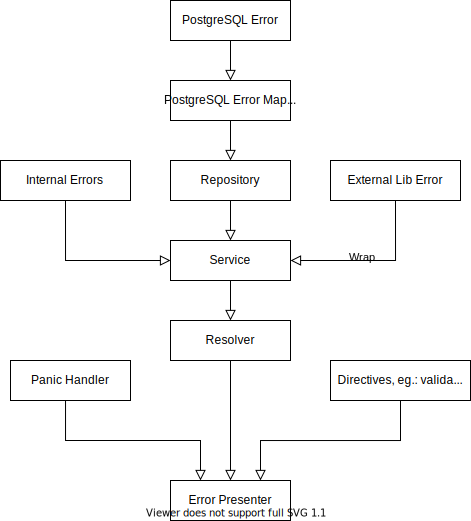

# Error handling in Director graphql

In compass director, we have to somehow filter errors which should be visible to user.
Basic list of errors which should be displayed to the user:
* InternalError
* NotFound
* NotUnique
* InvalidData
* InsufficientScopes
* ConstraintViolation
* TenantNotFound
* TenantNotExist

This list can be split into 2 groups due to different handling:
* internal errors
* the rest of errors, which will be presented to the user

In group of internal errors, are errors from:
* external libraries
* panics
* postgreSQL, except errors like NotFound, NotUnique

To deal with the errors we introduced custom errors, which contains error codes.

## Proposed custom errors and theirs error codes (the error codes can change):

| Error type           | Error code  |                            Description                                                            |
|----------------------|-------------|---------------------------------------------------------------------------------------------------|
| UnhandledError       | 10          | Error which cannot be handled in director and also is handled in old way                          |
| InternalError        | 11          | Error which cannot be handled in director                                                         |
| NotFound             | 20          | Error indicate that given resource cannot be found and further processing is impossible           |
| NotUnique            | 21          | Error indicates that given resource is not unique                                                 |
| InvalidData          | 22          | The input data is invalid, error description should be delivered in error message                 | 
| InsufficientScopes   | 23          | Error which indicate that the client doesn't have sufficient permissions to execute the operation |
| ConstraintViolation  | 24          | Error which indicate that this operation can't happen because referenced resource not exist       |
| TenantNotFound       | 25          | Tenant not found in request                                                                       |
| TenantNotExist       | 26          | Internal Tenant not found in director                                                             |

NotFoundError can be triggered in mutation like `addPackage` to not existing application.

## Proposed processing flow:

Description of following steps
* PostgreSQL Error Mapper - this component map postgreSQL errors to custom errors
* Error presenter - this component search for custom error in error stack. 
If such error is found, the presenter add `error_code` and `error` metadata to the graphql error in section `extensions`
In case of internal errors, the whole error is logged and `internal server error` is sent to client.
