# Pairing using Compass Connector

For simple use cases, Compass offers a direct approach for pairing Applications in which the Administrator can obtain pairing data and then provide it into the Application.

> **NOTE:** The Application must be created before the pairing is performed.

### Steps

1. The Administrator requests the pairing data for the Application using Cockpit (1).

1. Cockpit contacts the Director component to obtain the pairing data for the Application (2). After determining the way of pairing, the Director either contacts the Connector component to obtain the one-time token (3) or handles the `client_id` and `client_secret` generation on its own.

1. After obtaining the pairing data, the Administrator provides it to the Application instance (4).

1. If the pairing flow requires additional steps (such as signing the Client Certificate) the Application instance should perform those steps (5). The communication must be possible using the pairing data provided by the Administrator.

## Details

Compass offers a simple flow to obtain pairing detail. It also allows Application instances to establish a trusted relation to safely exchange their data. Compass provides multiple types of authentication. The `getAuthTypesForApplication(appId: ID!)` query returns all possible authentication types for a particular Application.

After determining the type of authentication, the `generateAuthForApplication(id: ID!, type: PairingAdapterAuthTypeInput!, inputParams: JSON!)` mutation can be called and the response will contain all required data to perform the pairing for the Application.

### Pairing using `client_id` and `client_secret`

One of the authentication types is the `client_id` and `client_secret` pair. In this case, the Director creates the `SystemAuth` entry for the Application and communicates with OAuth2 Provider inside the cluster to register new `client_id` and `client_secret`. Then, this pair is returned from the mutation and can be used to obtain a new token for the communication.

### Pairing using client certificates

Another way to secure communication is to use client certificates. In this case, Compass provides the Connector component. When requesting the authentication of this type, the Director component communicates with the Connector to obtain a one-time token which then should be used by the Application to perform the certificate signing process. For more details, see [this](./establishing-trusted-connection.md) document.
