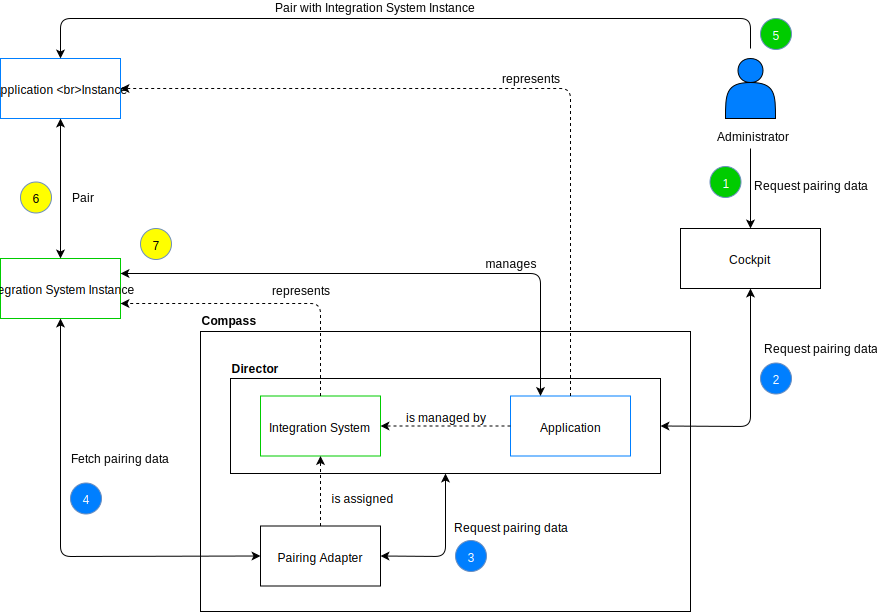

# Pairing Application with Integration System


When dealing with multiple Integration Systems, each of them may support different ways of establishing a trusted relation for the given Application instance. To provide a consistent experience for users, we introduce the concept of Pairing Adapters. Each Integration System can be coupled with one Pairing Adapter which will abstract the details on how the Integration System handles the trusted relation prerequisites.


This diagram illustrates the flow for pairing the Application with its Integration System instance using the Pairing Adapter:



>**NOTE:** The Application must be created before the pairing is performed. To create an Application that is managed by the Integration System, the Application must contain the `integrationSystemID` attribute set to the corresponding value. It can be simplified by creating the Application from the appropriate ApplicationTemplate. 

>**NOTE:** Each Integration System can be connected with one Pairing Adapter.

### Steps

1. The Administrator requests the pairing data for the Application using Cockpit (1).

1. Cockpit contacts the Director component to obtain the pairing data for the Application (2). The Application is loosely coupled with the Integration System that manages it. Thanks to this relation, the Director component is aware which Pairing Adapter is assigned to the Integration System. Knowing this, the Pairing Adapter is called to request the pairing data (3).

1. The Pairing Adapter calls the Integration System instance to obtain pairing data (4).

1. After obtaining the pairing data, the Administrator provides it to the Application instance (5) which allows the Application instance to establish a trusted relation with the Integration System instance (6). This informs the Integration System instance that there is a new Application instance that needs to be managed.

1. After the successful pairing, the Integration System instance can manage the Application (7).

>**NOTE:** The pairing process described here allows the Application to establish a trusted relation with its Integration System instance but it does not allow to establish a trusted relation between the Application and its Runtimes.

## Details

Compass supports multiple Integration System instances (represented internally by Integration Systems) to help abstract the way how Applications and Runtimes can be managed. Each Integration System can have its own approach to obtaining details for establishing a trusted relation for the managed system (Application, Runtime). To make the Director architecture clean and improve users' experience, we introduce the concept of Pairing Adapters. Each Integration System can be coupled with a Pairing Adapter. Thanks to this approach, the Directors' API can leverage different Integration Systems under a single mutation and handle the requests in a consistent manner. When Administrator wants to establish a new trusted relation between Application and Integration System, the Director API offers the `generateAuthForApplication(appID: ID!, type: AuthTypeInput!, inputParams: JSON!)` mutation.

The `generateAuthForApplication(appID: ID!, type: AuthTypeInput!, inputParams: JSON!)` mutation abstracts the way of obtaining trusted relation data from the Integration System. Calling the mutation with appropriate parameters checks whether the desired Application is under control of the Integrations System. If the underlying Integration System has Pairing Adapter assigned, the call is enriched with additional data defined for Integration System and data which comes from the request context (e.g. user ID). Next, the request is handed to the Pairing Adapter. The Pairing Adapter implements the logic required for obtaining all required data from the Integration System instance based on the incoming request.

In case the Application is not related to any Integration System, the `generateAuthForApplication(appID: ID!, type: AuthTypeInput!, inputParams: JSON!)` mutation abstracts fetching a one-time token or client credentials from the Connector, according to the credential type described by the `type` parameter.

The Integration System can support multiple authentication types. To determine the supported authentication types for a particular Application, the API offers the `getAuthTypesForApplication(appID: ID!)` query. The response for the query returns the possible values for the `type` parameter for authentication generation mutation.

## Pairing Adapter

Pairing Adapter is a component that knows how to get credentials from the Integration System. It can be deployed in the different falvours.

### Deployment

#### As a sidecar container for the Director component

In this case, the Pairing Adapter container is deployed together with the Director container. This deployment allows the Director to communicate with the given Pairing Adapter through the localhost interface on a given port. The configuration details for the Pairing Adapter needs to be present during the deployment and its lifecycle is bound to the Director component.

The given Integration System stores the internal port on which the Pairing Adapter service listens.

#### As a separate Pod exposed by the Kubernetes service internally (service of the ClusterIP type)

This type of deployment allows to run Pairing Adapter in a separate Pod. The Pairing Adapter runs in the same cluster as the Director component and its API does not have to be publically available. The Pairing Adapter API must be exposed through the Kubernetes service of the ClusterIP type. Having the Kubernetes service, the Director can communicate with the given Pairing Adapter through the DNS name of that service. This approach also allows for using the mTLS communication between components inside the cluster.

The given Integration System stores the DNS name of the internal Kubernetes service. The Pairing Adapter is exposed through this service.

#### As an external service provided by the Interation System itself

If the external component offers the implementation of the Pairing Adapter contract, the deployment of an additional component is not required. The Integration System can be directly bound with the external service. In this case, authentication between the Director and the Integration System instance is required. The Director supports OAuth 2.0 Client Credentials Grant for that purpose.

In this case, the Integration System stores the information regarding the credentials for the Pairing Adapter API access together with the required URLs.

### Pairing Adapter contract

To be able to act as a Pairing Adapter, the component must fulfill the following contract:

>**NOTE:** The component offers the GraphQL API. All the queries and mutations work in a synchronous manner.

1. It offers the `getAuthTypes(): [PairingAdapterAuthType!]` query that returns the collection of `PairingAdapterAuthType`.

1. It offers the `generateAuth(type: PairingAdapterAuthType, in: PairingAdapterParamsInput): PairingAuthResult!` mutation that handles the process of obtaining the pairing credentials from the Integration System instance.

`PairingAdapterAuthType` is the type that describes the supported authentication types for the PairingAdapter.

`PairingAdapterParams` is the type that describes the payload which is passed from the Director component to the Pairing Adapter. This payload should be sufficient for Pairing Adapter to obtain pairing data from the Integration System instance. The response from this mutation returns the `PairingAuthResult` type.

The GraphQL contract for the API looks as follows:

```graphql
input PairingAdapterAuthTypeInput {
    type: string!
}

input PairingAdapterParamsInput {
    tenantID: string!
    inputParams: JSON!
}

type PairingAdapterAuthType {
    type: string!
}

type PairingAuthResult {
    params: JSON!
}

type Query {
    getAuthTypes(): [PairingAdapterAuthType!]
}

type Mutation {
    generateAuth(type: PairingAdapterAuthTypeInput, in: PairingAdapterParamsInput): PairingAuthResult!
}
```
