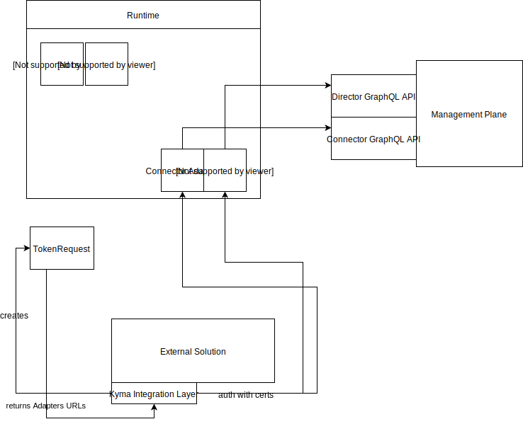

# Provide REST Adapter for Compass Graphql API
Compass GraphQL API is not compatible with Application Connector REST API.
To avoid rewriting integration layer for  Application Connector clients, we can provide adapter that translates
Application Connector API to Compass API.


# Reproducing tutorial steps
This section describes required modifications, that needs to be done to ensure that Application Connector tutorial 
described [here](https://kyma-project.io/docs/1.8/components/application-connector/#tutorials-tutorials)
still works.

1. Create a new Application

In the old approach, Application CR was created manually in the Runtime. In the new approach, Agents read information from Compass 
Director and creates appropriate Application CRs.
There is an open question, what should happen for manually created Application CRs. Right now, Agent ignores them completely.
If there is a requirement, that manually created Application should be automatically registered in the Compass, 
a new Controller has to be implemented.
If there is a requirement, that manually created Application CR should be handled by old services, this complicates implementation, 
because status of TokenRequest will be populated differently, depending if Application CR comes from Agent or was created manually.

AFAIK, creating application was a manual step usually performed in UI. Because of that, we should consider
not introducing previously mentioned controller, and just instruct Admins to create application using Compass UI. 

2. Get the client certificate

When creating Token Request, a  Controller updates the status and provide token and configuration URL fields.
Controller needs to be reconfigured, to point to the REST Adapter endpoint `/v1/applications/signingRequests/info`. Token is generated via sending request to `/v1/applications/tokens` and this also has to be reconfigured to point to the Adapter Endpoint.
REST Adapter forwards request to mutation `requestOneTimeTokenForApplication`.
This mutation consumes applicationID, so we need to have mapping from application name to application ID in Compass (to check if it is stored in CR).

Calling `/v1/applications/signingRequests/info` endpoint, following data is returned:
```json

{
    "csrUrl": "",
    "api":{
        "metadataUrl":      "",
        "eventsUrl":        "",
        "infoUrl":          "",
        "certificatesUrl":  "",
    },
    "certificate":{
        "subject":"OU=Test,O=TestOrg,L=Waldorf,ST=Waldorf,C=DE,CN={APP_NAME}",
        "extensions": "",
        "key-algorithm": "rsa2048",
    }
}
```

`csrUrl` should point to the adapter's `/v1/applications/certificates`.
`certificate` field is populated by adapter by calling Connector's GraphQL query `configuration`. 

3. Register a service

```
curl -k --cert ./app1_client.crt   --key ./generated.key -X POST https://gateway.34.77.12.120.xip.io/app1/v1/metadata/services --data-binary "@serviceRegistrationManyAPIs.json"
```
```json
{
  "provider":"SAP",
  "name":"api1",
  "description": "api1 desc",
  "shortDescription": "api1 short desc",
  "identifier": "api1Identifier",
  "labels":{
  	"label1":"value1",
  	"label2": "value2"
  },
  "api":{
  	"targetUrl":"http://some-app1.pl",
  	"requestParameters": {
  	  "headers": {
  	      "header1": "value1"
  	  }
  	}
  }

}
```
Compass equivalent: `addApiDefinition` or `addEventDefinition`

Challenges:

- in old API, there is a Service which seems to be equivalent to API Package, which is missing in Compass
- `identifier` has no mapping in Compass API
- you cannot label service class via Compass API
- specificationURL, specificationCredentials, specificationRequestParameters can be mapped to FetchRequest, but it is not yet implemented
- from Documentation:
> If the api.spec or api.specificationUrl parameters are not specified and the api.type parameter is set to OData, the Application Registry will try to fetch the specification from the target URL with the $metadata path.

Special handling for OData can be implemented in the Adapter (assuming that FetchRequest is implemented)

TODO: CSRF tokens are not implemented in Compass
- documentation: in Compass, documentation can be added only on the Application level

# Diagram


Kyma Integration Layer implemented as a part of the External Solution reads status of the TokenRequest, which returns URL pointing to Adapters.
Adapters proxies calls to Compass components (REST --> GraphQL) and performing type conversions. 
Still open question is how to propagate credentials, for example Adapter endpoint is reached using client certificate, can we propagate
that certificate when making a call to Compass components?