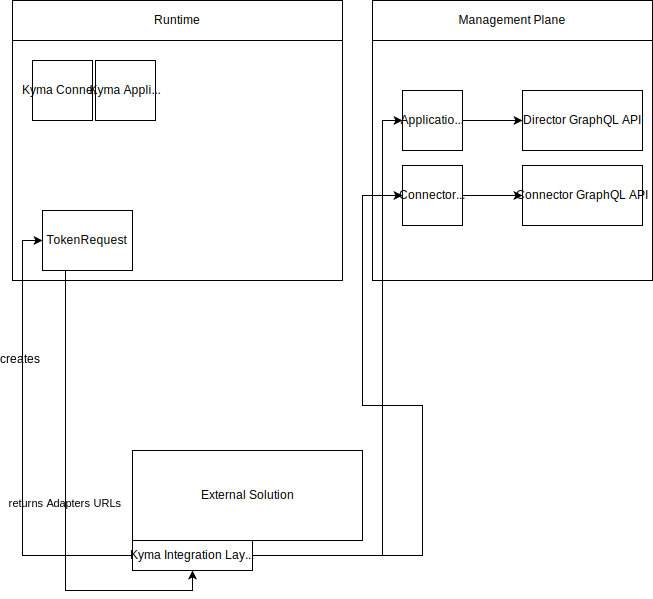

# Provide REST Adapter for Compass Graphql API
Compass GraphQL API is not compatible with Application Connector REST API.
To avoid rewriting integration layer for  Application Connector clients, we can provide adapter that translates
Application Connector API to Compass API.


## Reproducing tutorial steps
This section describes modifications required to ensure that the [Application Connector tutorial](https://kyma-project.io/docs/1.8/components/application-connector/#tutorials-tutorials) still works.

1. Create a new Application

In the former approach, the Application CR was created manually in a Runtime. In the new approach, Agent reads information from the 
Director and creates appropriate Application CRs.
There is an open question, what should happen for manually created Application CRs. Right now, Agent ignores them completely.
* If there is a requirement that manually created Application should be automatically registered in Compass, 
a new Controller has to be implemented.
* If there is a requirement that manually created Application CR should be handled by the former services, this complicates the implementation as 
the status of TokenRequest will be populated differently, depending on whether the Application CR comes from Agent or was created manually.

AFAIK, creating an Application was a manual step usually performed in UI. Because of that, we should consider
not introducing previously mentioned controller, and just instruct Admins to create an Application using Compass UI. 

2. Get a client certificate

When creating a TokenRequest, the Controller updates the status and provides token and configuration URL fields.
The Controller needs to be reconfigured to point to the REST Adapter endpoint `/v1/applications/signingRequests/info`. A token is generated by sending a request to `/v1/applications/tokens` and this also has to be reconfigured to point to the Adapter endpoint.
REST Adapter forwards the request to the `requestOneTimeTokenForApplication` mutation.
This mutation consumes applicationID, so we need to have a mapping from the Application name to the Application ID in Compass (to check if it is stored in CR).

After calling the `/v1/applications/signingRequests/info` endpoint, the following data is returned:
```json

{
    "csrUrl": "",
    "api":{
        "metadataUrl":      "",
        "eventsUrl":        "",
        "infoUrl":          "",
        "certificatesUrl":  "",
    },
    "certificate":{
        "subject":"OU=Test,O=TestOrg,L=Waldorf,ST=Waldorf,C=DE,CN={APP_NAME}",
        "extensions": "",
        "key-algorithm": "rsa2048",
    }
}
```

`csrUrl` should point to the adapter's `/v1/applications/certificates`.
`certificate` field is populated by adapter by calling Connector's GraphQL query `configuration`. 

3. Register a service

```
curl -k --cert ./app1_client.crt   --key ./generated.key -X POST https://gateway.34.77.12.120.xip.io/app1/v1/metadata/services --data-binary "@serviceRegistrationManyAPIs.json"
```
```json
{
  "provider":"SAP",
  "name":"api1",
  "description": "api1 desc",
  "shortDescription": "api1 short desc",
  "identifier": "api1Identifier",
  "labels":{
  	"label1":"value1",
  	"label2": "value2"
  },
  "api":{
  	"targetUrl":"http://some-app1.pl",
  	"requestParameters": {
  	  "headers": {
  	      "header1": "value1"
  	  }
  	}
  }

}
```
Compass equivalent: `addApiDefinition` or `addEventDefinition`

Challenges:

- in the former API, there is a service which seems to be equivalent to API Package that is missing in Compass
- `identifier` has no mapping in the Compass API
- you cannot label ServiceClass using Compass API
- specificationURL, specificationCredentials, specificationRequestParameters can be mapped to FetchRequest, but it is not yet implemented
- quoting the documentation:
> If the api.spec or api.specificationUrl parameters are not specified and the api.type parameter is set to OData, the Application Registry will try to fetch the specification from the target URL with the $metadata path.

Special handling for OData can be implemented in the Adapter (assuming that FetchRequest is implemented).

TODO: 
- CSRF tokens are not implemented in Compass
- Documentation: in Compass, documentation can be added only on the Application level

# Diagram


Kyma Integration Layer, implemented as a part of the external solution, reads the status of the TokenRequest that returns a URL pointing to Adapters.
Adapters proxy calls to Compass components (REST --> GraphQL) and perform type conversions. 
Still, the open question is how to propagate credentials. For example, the Adapter endpoint is reached using a client certificate. Can we propagate
that certificate when making a call to Compass components?
