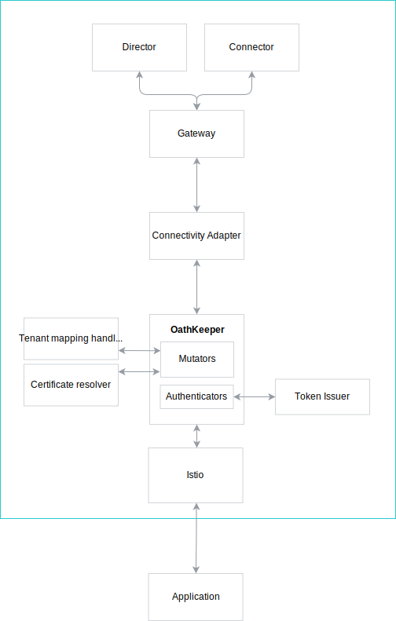

# Security

The Connectivity Adapter must provide seamless support for currently used security mechanisms. In the legacy approach, we support two flavors for securing the communication between the clients and the API. The main traffic is secured by the client credentials and for establishing the trusted relation, the one-time tokens are used. The Compass API also offers similar security mechanisms. This document describes how legacy calls can be handled to fulfill the security requirements of the Compass API.

## Details

The Compass GraphQL API supports the security mechanism used by the legacy REST API. Having this in mind, we should reuse as much of the implementation as possible. We can route the incoming REST API traffic in the same way as the new GraphQL API. Thanks to that, the incoming traffic will be handled by Istio and then routed to the Ory Oathkeeper, reusing already implemented hydrators. The hydrators will handle all the details related to the one-time tokens, client certificate, tenant and scopes assignment. Having the security-related topics done, we can transform the REST API request to the corresponding GraphQL call(s) and post it to the internal endpoint of the Compass Gateway. This diagram depicts the described flow:

