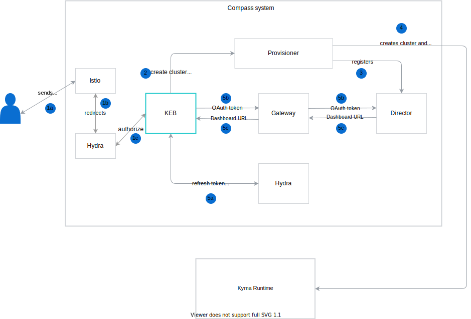

# Architecture

The diagram and steps describe the Kyma Environment Broker (KEB) workflow and the roles of specific  resources in this process:

1. The user sends request to create a new cluster with Kyma Runtime.
2. KEB proxies the request to create a new cluster to the Provisioner component.
3a. Provisioner creates a new cluster and installs Kyma Runtime.
3b. Provisioner registers the new cluster in the Director component.
4. KEB sends a request to Hydra to refresh the OAuth token.
5. KEB passes the OAuth token through Gateway to Director.
6. Director returns the Dashboard URL, which is the URL to the newly created cluster, through Gateway to KEB.
