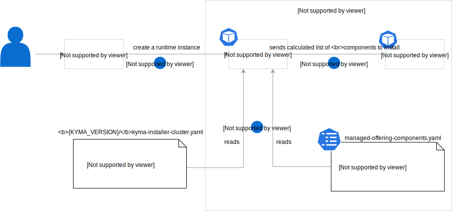

# Runtime components

The diagram and steps describe the Kyma Environment Broker (KEB) workflow for calculating and processing runtime components:

1. During the KEB initialization 

   a. it downloads and saves the `kyma-installer-cluster.yaml` from the given Kyma version
   
   b. it reads the `managed-offering-components.yaml` file with additional managed components 
      and adds them at the end of the base Kyma components list

2. A user triggers runtime provisioning and sends the list of optional components that want to install.
   
3. KEB calculates the final components list by removing components that were not selected by users in step 2. 
   Additionally, adds the proper global and components overrides and sends whole provisioning information to provisioner.

## Optional Components

The functionality for disabling the optional components is implemented in  [kyma-environment-broker](../../components/kyma-environment-broker) component.

List of optional components:
- Loki
- Kiali
- Jaeger
- Monitoring

Read [this](../../components/kyma-environment-broker/README.md#development) section to find more information how to add or remove functionality for disabling components.  