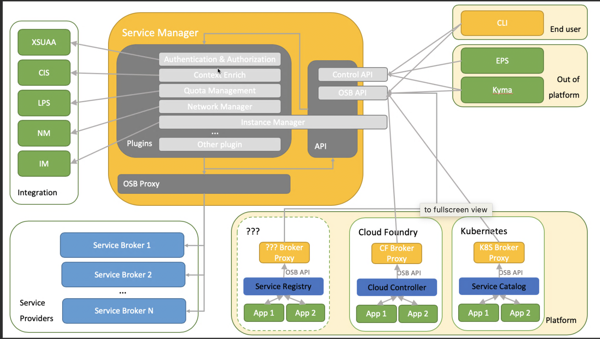

# Dictionary 

Describes what we are really talking about.

## CFUAA

CFUAA stands for Cloud Foundry User Account and Authentication. It is the implementation of the UAA of the Open Source Cloud Application Platform Cloud Foundry. UAA is an open source project of Cloud Foundry and it is available through a variety of private cloud distributions. SAP is a major contributor. In developer speak, the term CFUAA is used to distinguish the UAA of Cloud Foundry from the XSUAA.

## Platform UAA

At SAP, the Platform UAA is often simply called UAA. It is an open source UAA of Cloud Foundry (or CFUAA), but it is deployed in the Cloud Foundry environment of SAP Cloud Platform.

The Platform UAA manages the platform users (space developers and administrators). The platform users are allowed to use the cockpit and to interact with the Cloud Controller. They can use the Cloud Foundry CLI, push and scale applications, and create service instances. Platform users are authenticated via SAP ID service.

## XSUAA

The User Account and Authentication service (UAA) is the central infrastructure component of the Cloud Foundry environment at SAP Cloud Platform for user authentication and authorization. The XSUAA has been developed by SAP. It is an extension of the CFUAA and acts as the central infrastructure component of the Cloud Foundry environment at SAP Cloud Platform for business user authentication and authorization. SAP has enhanced the CFUAA by adding a service broker, multitenancy, management API functions, and some minor enhancements. The XSUAA manages business users and enables them to authenticate to applications deployed in SAP Cloud Platform.

## CIS and ERS

Commercial Infrastructure Services (CIS) is a fundamental part of the SAP Cloud Platform Foundation, serving both commercials, technical and operational goals. One of sub-domain is **CIS Provisioning and registries (XRS, ERS, XPR, Tenant LCM)** which contains Environment Registry Service (ERS).	

The ERS manages the lifecycle of environment instances like CF organizations, K8S clusters. During provisioning context is passed to the provisioned environment and mapping between environment instance and the commercial context is kept (binding to subaccount).
