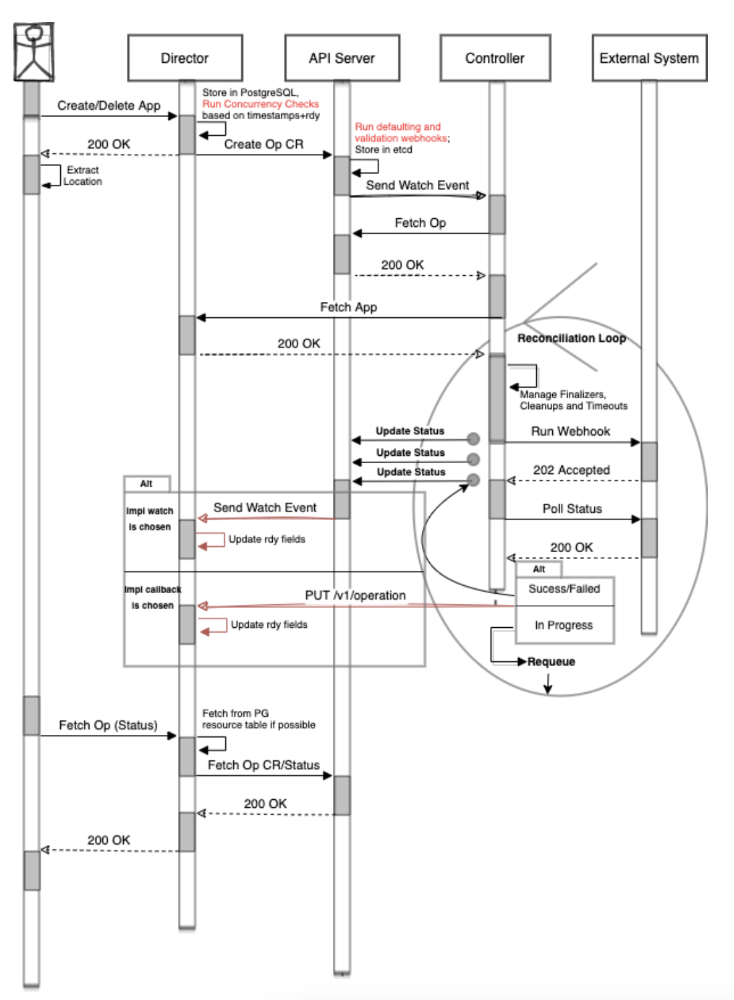

# Asynchronous Unpair and Unregister of Applications

## Unpair and Unregister

The unpair operation keeps the application, its APIs and events but clears the issued credentials and any externally created resources. On the other hand, the unregister operation results in a complete deletion of the application from the Director database, together with all of its related internal and external resources. 

From the perspective of the Operations Controller, both operations are the same. This is so, because it performs the same operations for both when it deletes the externally created resources.

The process flow that follows is valid for both _unpair_ and _unregister_ processes.

## Process Flow

1. Director receives an unpair (or unregister) request.
1. A GraphQL directive for asynchronous operations is triggered before the request is processed.
1. Scheduler (built in Director) checks if there is a concurrent operation running and returns one of the follwoing: 
    - If there is a concurrent operation in progress, an error response is returned.
    - If no operation is in progress, the Scheduler creates a new Operation CRD.
1. Then, the GraphQL flow continues and an appropriate response with poll URL is returned to the client.
1. The Operations Controller processes the new operation as follows:
    1. Retrieves the application from Director along with its webhooks (application and application template owned).
    1. Initiates the delete operation on the external system side.
    1. Gets the _Poll URL_ from the response and checks the status of the operation in it.
    1. When the operation is finished in the external system (regardless of its success) the Operations Controller notifies Director that the operation is finalized with the given status.
1. When Director receives the finalization notification it proceeds as follows:
    * In case of unpair, it marks the application as ready and prevents any follow-on asynchronous operations.
    * In case of unregister, it deletes the application and all related resources.
    

A diagram of the reconciliation loop in more detail:

