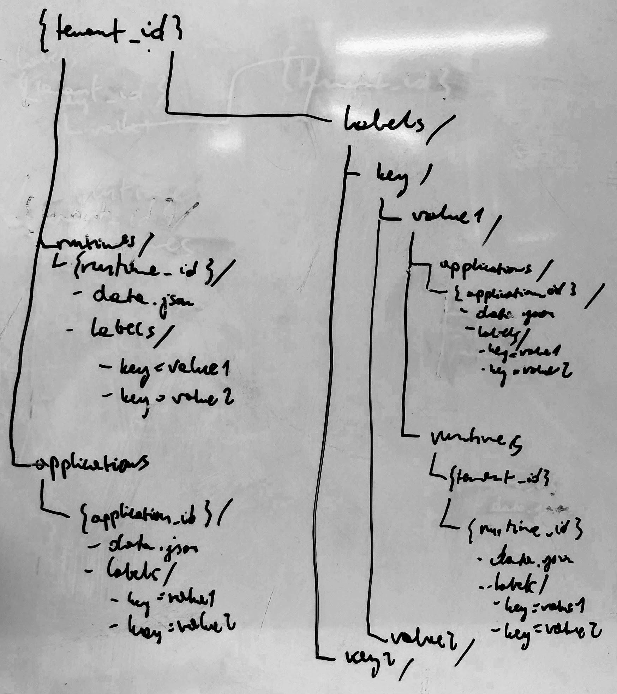

# Storage

Description of using static object storage as database for Application Registry.

## Storing Application labels

There were an idea to use Apache Parquet for storing the pieces of information regarding labels.
We want to have an easy access to the pieces of information:
    - list all labels for application 
    - query application by label
    - list all labels

### S3-based Solution

To achieve querying by groups, the following bucket structure is suggested:

Data redundancy is needed to reduce requests while doing read operations.

**Runtime creation**

- Create `data.json` file in `{tenant_id}/runtimes/{runtime_id}` directory (1 request)

For every label of the runtime (N is the number of the runtimes):
- Create `{key}={value}` file for every label in `{tenant_id}/runtimes/{runtime_id}/labels` (N requests)
- Create `data.json` file in `{tenant_id}/labels/{key}/{value}/runtimes/{runtime_id}` directory (N requests)
- Create `key=value` file in `{tenant_id}/labels/{key}/{value}/runtimes/{runtime_id}/labels` directory (N * N requests)

Total calls: N^2 + 2*N + 1

**Application registration**

Similar to Runtime creation - replace `runtimes` with `applications`

Total calls: N^2 + 2*N + 1

**Adding label to Application**

- Create file `{key}={value}` in `{tenant_id}/applications/{application_id}` directory (1 request)
- Copy files from `{tenant_id}/applications/{application_id}` to `{tenant_id}/labels/{key}/{value}/applications/{application_id}` directory (every file is a separate request; 1 request for data.json + N for labels)

Total calls: N + 2

**List all runtimes**

- List all directories under `{tenant_id}/runtimes` (1 request)

For every runtime (N is the number of the runtimes):
- Get `data.json` file from `{tenant_id}/runtimes/{runtime_id}` directory (N requests)

Total calls: N + 1

**List all applications**

Similar to listing all runtimes - replace `runtimes` with `applications`

Total calls: N + 1

**List application by label**

- List all directories under `{tenant_id}/labels/{key}/{value}/applications` (1 request)

For every application (N is the number of the application):
- Get `data.json` file from `{tenant_id}/labels/{key}/{value}/applications/{application_id}` directory (N requests)

Total calls: N + 1

**List all labels**

- List all directories in `{tenant_id}/labels` (1 request)
- Iterate over the list and construct all possible labels ({key}={value})

Total calls: 1

**List all possible values for label key**

- List all directories under `{tenant_id}/labels/{key}` (1 request)

Total calls: 1

### Pros
- low cost
- region replication
- backup

### Cons
- multiple calls to S3 every time we want to read, write or delete some data. 

    For example, to query all 10 runtimes for tenant, we would need to do 11 calls to S3:
    -   1 for listing all files in directory
    -   10 requests to download files with data for every runtime.
    -   to Add new runtime with 2 labels, we would need to upload 9 files because of the data redundancy (9 calls - 6 files for labels and 3 files with runtime data)

- complex implementation for adding, removing and querying data
- problems with caching while cross-region replication - 

## Cross-region replication

The following section describes a comparison between cloud-storage offerings, regarding the cross-region replication5

### Google Cloud Platform

We can create multi-regional GCS buckets, but this functionality is limited to the following options:

- United States (multiple regions in the United States) 
- European Union (multiple regions in the European Union) 
- Asia (multiple regions in Asia)
- eur4 (Finland and Netherlands) 
- nam4 (Iowa and South Carolina) 

We cannot replicate a single bucket across multiple regions like Asia, USA and Europe.

### AWS S3

Amazon has [Cross-region replication for S3 buckets](https://docs.aws.amazon.com/AmazonS3/latest/dev/crr.html). One bucket would be used to write, and others to read.

## Summary

There are many [discussions](https://www.quora.com/How-can-we-use-Amazon-S3-as-a-database) whether using S3 as database is a good idea. It might work in some specific use cases, but generally it is not suggested to do so.

In our case using S3 will make the Registry implementation much more difficult. Doing so many request per single read/write operation will mean that every request to the Registry will be slow - much slower than typical (No)SQL database.

